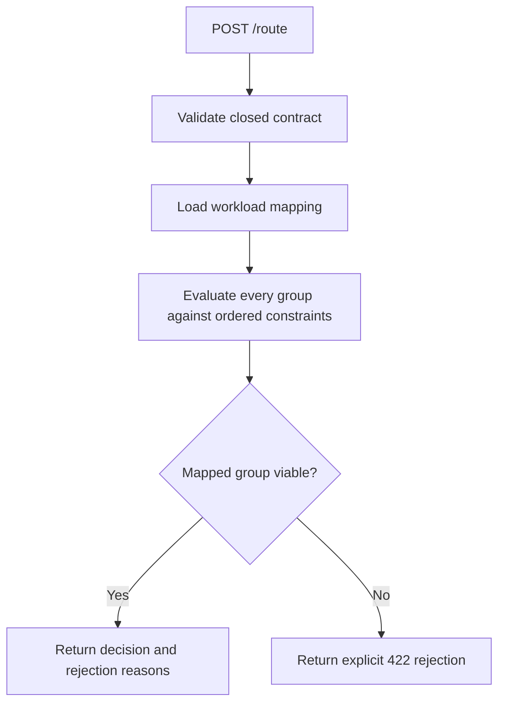

# Policy Model Router

[](https://github.com/brunovicco/policy-model-router/actions/workflows/quality.yml)
[](https://www.python.org/)

Read this in [Português](README.pt-BR.md).

A deterministic, fail-closed routing service that selects an approved model group for an LLM
workload before inference.

The router keeps model choice out of agent prompts and
application code. A caller describes the
workload, data classification, context size, and operational limits; `POST /route` evaluates that
request against a versioned policy and returns either an explainable decision record or an
explicit rejection. It does not call an LLM.

## Why this exists

An enterprise AI system often has several model deployments with different data authorizations,
capabilities, context windows, latency profiles, and costs. Letting every agent choose a model on
its own makes those decisions difficult to govern, reproduce, and audit.

Policy Model Router centralizes that boundary:

- workload-to-model-group mappings are declarative and versioned in
  [`config/routing_policy.yaml`](config/routing_policy.yaml);
- hard constraints eliminate ineligible groups in a fixed order;
- the same request and policy produce the same selected group and rejection reasons;
- every non-selected group is included in the decision with an explanation;
- invalid or incomplete policies fail closed instead of silently falling back;
- the API returns stable, machine-readable error envelopes.

The selected value is a logical model group such as `reasoning-medium`, not a provider or a
deployment. Provider selection, failover, credentials, and the actual inference call belong to a
downstream model gateway.

## How routing works



For each request, the application use case:

1. Finds the model group mapped to the requested workload.
2. Evaluates every configured group against the constraints below, stopping at the first failure
   for each candidate.
3. Selects the mapped group only if it survives every constraint.
4. Reports every other group as rejected, either because it failed a constraint or because the
   workload maps elsewhere.
5. Rejects the request if the mapped group is ineligible. The current version does not substitute
   a different group or apply a weighted score.

Decision IDs and timestamps are generated at runtime; model-group selection and reasons are the
deterministic part of the result.

### Constraint order

Order matters because the first failed constraint becomes that candidate's rejection reason.

| # | Constraint | Candidate is rejected when |
|---:|---|---|
| 1 | Data classification | The group is not authorized for the request's classification |
| 2 | Risk level | The group is not authorized for the request's workflow risk tier |
| 3 | Structured output | The request requires structured output and the group does not support it |
| 4 | Tool calling | The workload requires tool calling and the group does not support it |
| 5 | Context window | Estimated input tokens exceed the group's limit |
| 6 | Cost ceiling | Estimated group cost exceeds `max_cost_usd` |
| 7 | Latency ceiling | Typical group latency exceeds `max_latency_ms` |
| 8 | Availability | The provider resolves the group as unavailable (see [Availability](#availability)) |
| 9 | Agent allowlist | The group is restricted and the requesting agent is not listed |

The predicates live in
[`src/policy_model_router/domain/constraints.py`](src/policy_model_router/domain/constraints.py),
and the two-step selection algorithm lives in
[`src/policy_model_router/application/route_model.py`](src/policy_model_router/application/route_model.py).

## Shipped policy

The repository includes an example policy for five workload types and four logical model groups.
Values are deployment-policy inputs, not live provider measurements.

### Workload mappings

| Workload | Mapped model group | Native tool calling required |
|---|---|---:|
| `document_extraction` | `fast-small` | No |
| `cashflow_analysis` | `reasoning-medium` | No |
| `findings_correlation` | `reasoning-strong` | No |
| `opinion_drafting` | `reasoning-strong` | No |
| `json_repair` | `fast-structured-output` | No |

### Model-group profiles

| Model group | Authorized data | Authorized risk | Structured output | Tool calling | Context | Typical latency | Estimated cost |
|---|---|---|---:|---:|---:|---:|---:|
| `fast-small` | public, internal | low, medium | No | Yes | 16,000 | 3,000 ms | USD 0.01 |
| `reasoning-medium` | public, internal, confidential, restricted | low, medium, high | No | Yes | 64,000 | 15,000 ms | USD 0.05 |
| `reasoning-strong` | public, internal, confidential, restricted | low, medium, high, critical | No | Yes | 128,000 | 30,000 ms | USD 0.20 |
| `fast-structured-output` | public, internal | low, medium | Yes | No | 8,000 | 2,000 ms | USD 0.01 |

The authorized-risk column reflects a decision-quality rule, not a data-protection one: a group can
be fully cleared for the data involved and still be unauthorized for a high-stakes decision (see
[ADR-0005's amendment](docs/adr/0005-deterministic-policy-routing.md)). All four groups are marked
available and have unrestricted agent allowlists in the shipped policy. Change those values
deliberately for each environment.

## Quick start

Requirements: Python 3.13 and [uv](https://docs.astral.sh/uv/).

```bash
git clone https://github.com/brunovicco/policy-model-router.git
cd policy-model-router
uv sync --frozen
export API_KEYS='{"credit-analysis-agent":"dev-local-key"}'   # required; keyed by agent_name
uv run uvicorn policy_model_router.entrypoints.http:app --reload
```

The service starts on `http://127.0.0.1:8000` and loads `config/routing_policy.yaml` once during
startup. Every `POST /route` call needs the `X-API-Key` header shown below; see
[Authentication and rate limiting](#authentication-and-rate-limiting).

### Request a decision

This request contains restricted data and a 100,000-token context, so only the workload's mapped
`reasoning-strong` group remains viable:

```bash
curl --request POST http://127.0.0.1:8000/route \
  --header 'Content-Type: application/json' \
  --header 'X-API-Key: dev-local-key' \
  --data '{
    "schema_version": "1.0",
    "requested_at": "2026-07-22T12:00:00Z",
    "workflow_id": "credit-review-42",
    "task_id": "correlate-findings-7",
    "agent_name": "credit-analysis-agent",
    "workload": "findings_correlation",
    "risk_level": "high",
    "data_classification": "restricted",
    "context_tokens_estimated": 100000,
    "structured_output_required": false,
    "max_latency_ms": 60000,
    "max_cost_usd": 1.00
  }'
```

Example response:

```json
{
  "schema_version": "1.0",
  "routing_decision_id": "674088f4-cd75-45e9-a6b5-5e85b8cc5588",
  "decided_at": "2026-07-22T12:00:01Z",
  "workflow_id": "credit-review-42",
  "task_id": "correlate-findings-7",
  "selected_model_group": "reasoning-strong",
  "reason": "workload 'findings_correlation' maps to model group 'reasoning-strong' and satisfies all constraints",
  "rejected_candidates": [
    {
      "model_group": "fast-small",
      "reason": "not authorized for data classification 'restricted'"
    },
    {
      "model_group": "fast-structured-output",
      "reason": "not authorized for data classification 'restricted'"
    },
    {
      "model_group": "reasoning-medium",
      "reason": "estimated context 100000 tokens exceeds group limit of 64000 tokens"
    }
  ]
}
```

### Hard rejection

`document_extraction` maps to `fast-small`, which is not authorized for confidential data in the
shipped policy. The router does not silently promote the request to a stronger group:

```json
{
  "error": {
    "code": "no_viable_model_group",
    "message": "no viable model group for workload 'document_extraction': mapped group 'fast-small' rejected (not authorized for data classification 'confidential')"
  }
}
```

The response status is `422 Unprocessable Entity`.

## API contract

`POST /route` accepts a closed schema: unknown fields are rejected, identifiers must be non-empty,
timestamps must be timezone-aware UTC values, and numeric limits must be positive.

| Field | Accepted values or rule |
|---|---|
| `schema_version` | Exactly `1.0` |
| `requested_at` | UTC timestamp |
| `workflow_id`, `task_id`, `agent_name` | Non-empty strings |
| `workload` | `document_extraction`, `cashflow_analysis`, `findings_correlation`, `opinion_drafting`, or `json_repair` |
| `risk_level` | `low`, `medium`, `high`, or `critical` |
| `data_classification` | `public`, `internal`, `confidential`, or `restricted` |
| `context_tokens_estimated` | Integer greater than or equal to zero |
| `structured_output_required` | Boolean |
| `max_latency_ms` | Positive integer |
| `max_cost_usd` | Positive decimal value |

Stable error codes are:

| HTTP status | Code | Meaning |
|---:|---|---|
| 401 | `unauthorized` | Missing or invalid `X-API-Key` header |
| 422 | `invalid_request` | The request does not match the contract |
| 422 | `no_viable_model_group` | The workload's mapped group failed a hard constraint |
| 429 | `rate_limit_exceeded` | Too many requests for this `(client IP, agent_name)` pair |
| 500 | `misconfigured_routing_policy` | A runtime policy has no mapping for a recognized workload |

A missing, malformed, unknown-field, or incomplete YAML policy prevents the service from starting.

## Policy configuration

Edit [`config/routing_policy.yaml`](config/routing_policy.yaml) to manage workload mappings and
model-group capabilities. The loader requires complete coverage of every declared workload and
model group and rejects unknown fields.

Use `ROUTING_POLICY_PATH` to load an environment-specific file:

```bash
ROUTING_POLICY_PATH=/etc/policy-model-router/routing_policy.yaml \
  uv run uvicorn policy_model_router.entrypoints.http:app --host 0.0.0.0 --port 8000
```

Other runtime settings:

| Environment variable | Default | Purpose |
|---|---|---|
| `APP_ENV` | `development` | Environment label attached to structured logs |
| `LOG_LEVEL` | `INFO` | Python logging level |
| `LOG_FORMAT` | `json` | Use `console` for human-readable local logs |
| `API_KEYS` | *(required)* | JSON object mapping each `agent_name` to its own API key, checked against the `X-API-Key` header on `POST /route`; the service refuses to start if unset, empty, or malformed |
| `RATE_LIMIT_MAX_REQUESTS` | `60` | Requests allowed per `(client IP, agent_name)` pair per window |
| `RATE_LIMIT_WINDOW_SECONDS` | `60` | Rate-limit window length, in seconds |
| `RATE_LIMIT_MAX_TRACKED_KEYS` | `100000` | In-memory limiter only (ignored once `REDIS_URL` is set): caps distinct `(client IP, agent_name)` keys held in memory, evicting the least-recently-touched one past this limit |
| `REDIS_URL` | *(unset)* | Optional. Shares the rate limit across replicas via Redis (ADR-0008); requires `uv sync --extra rate-limit`. Unset keeps the default in-memory, per-process limiter |

## Authentication and rate limiting

`POST /route` requires a valid `X-API-Key` header, matched against the key configured for the
request's own `agent_name` in `API_KEYS` (constant-time comparison); a missing key, a wrong key, or
a key that belongs to a different agent all return `401 unauthorized` — the response never reveals
which agent names are configured. One agent's key can be rotated or revoked without affecting any
other agent. This is still not full IAM: there is no key expiry, scoping beyond "may call `/route`
as this agent," or identity assurance stronger than "knew the right key" — see
[ADR-0007's amendment](docs/adr/0007-http-boundary-hardening.md) for what a stronger mechanism
(mTLS, OAuth2 client credentials) would add.

It is also rate-limited per `(client IP, agent_name)` pair (`RATE_LIMIT_MAX_REQUESTS` per
`RATE_LIMIT_WINDOW_SECONDS`); exceeding it returns `429 rate_limit_exceeded`. By default this is an
in-memory, fixed-window counter, **per process**, bounded to `RATE_LIMIT_MAX_TRACKED_KEYS` distinct
keys — a multi-instance deployment enforces the limit per instance, not cluster-wide (ADR-0007).
Set `REDIS_URL` (and install `uv sync --extra rate-limit`) to share the limit across replicas
instead; run `docker compose up -d redis` for a local instance. The Redis-backed limiter fails open
on a backend error (it allows the request rather than blocking routing traffic on an unrelated
outage) but fails the service closed at startup if the configured Redis is unreachable (ADR-0008).

The rate-limit key's IP component is always the raw TCP peer address — this service never reads
`X-Forwarded-For`/`Forwarded`. Behind a reverse proxy, every real client shares the proxy's IP,
collapsing per-client granularity to one shared bucket; if you need real per-client granularity in
that topology, configure the proxy to pass a trusted header and configure Uvicorn/Starlette to
trust only that specific hop (e.g. `--forwarded-allow-ips` scoped to the proxy's address) — never
trust forwarded headers from an unrestricted set of peers, or any client could forge the header and
multiply its quota. See [ADR-0008's second amendment](docs/adr/0008-redis-shared-rate-limiter.md)
for the full rationale.

## Availability

`ModelGroupProfile.available` in `config/routing_policy.yaml` is a static, hand-edited flag. The
application layer resolves it through an `AvailabilityProvider` port
([ADR-0006](docs/adr/0006-availability-provider-port.md)); the only implementation shipped today,
`StaticAvailabilityProvider`, passes that flag through unchanged. There is no live provider/gateway
health check yet — the port exists so one can be added later as a new adapter, without changing the
routing use case or the domain constraints.

## Health, readiness, and metrics

`GET /health` always returns `200 {"status": "ok"}` once the process is serving requests. `GET
/readyz` returns `200 {"status": "ready"}` once the routing policy loaded successfully at startup.
`GET /metrics` returns Prometheus-format output, today limited to
`policy_model_router_rate_limiter_backend_unavailable_total` — a counter incremented every time
the Redis-backed rate limiter fails open because Redis was unreachable; alert on
`increase(policy_model_router_rate_limiter_backend_unavailable_total[5m]) > 0` (summed across
replicas) to catch a sustained outage instead of relying on the `rate_limiter_backend_unavailable`
log line alone. None of these three endpoints requires `X-API-Key` or counts against the rate
limit, so orchestrators and scrapers can probe them cheaply. `/readyz` is a shallow check: this
service has no external dependency to probe, so "ready" means "startup completed," not "a
downstream system is healthy."

None of the three is restricted at the network layer by this repository — that's an ingress/mesh
concern, the same way deploying `/route` behind an authenticated gateway is. In production,
restrict `/metrics` (and, more loosely, `/health`/`/readyz`) to internal scrapers/orchestrators.

## Container

Build and run the non-root, multi-stage image:

```bash
docker build -t policy-model-router .
docker run --rm -p 8000:8000 policy-model-router
```

SemVer tags trigger the repository's publish workflow, which builds the image and pushes its
versioned tags to GitHub Container Registry after the quality gate passes.

## Architecture

The code follows a Clean Architecture dependency direction:

```text
entrypoints -> application -> domain
adapters    -> application/domain
domain      -> no outer layer
```

- `domain`: closed vocabularies, policy value objects, routing requests and decisions, and pure
  constraint predicates;
- `application`: deterministic routing use case and clock/ID/availability ports;
- `adapters`: YAML policy loader, system clock, UUID generator, static availability provider,
  in-memory rate limiter (default) and optional Redis-backed rate limiter, and opt-in tracing
  support;
- `entrypoints`: Pydantic wire contracts, FastAPI endpoints (`/route`, `/health`, `/readyz`), error
  mapping, and structured logging.

The policy is loaded once at startup, and request handling is stateless. See
[`docs/ARCHITECTURE.md`](docs/ARCHITECTURE.md) for the dependency rules and diagrams, and the
[ADR index](docs/ARCHITECTURE.md#related-decisions) for why the provider boundary
([ADR-0004](docs/adr/0004-litellm-provider-boundary.md)), the routing algorithm
([ADR-0005](docs/adr/0005-deterministic-policy-routing.md)), the availability seam
([ADR-0006](docs/adr/0006-availability-provider-port.md)), the HTTP boundary hardening
([ADR-0007](docs/adr/0007-http-boundary-hardening.md)), and the optional shared rate limiter
([ADR-0008](docs/adr/0008-redis-shared-rate-limiter.md)) look the way they do.

## Current scope

The MVP intentionally does not:

- choose a provider, deployment, or API credential;
- call a model or run a live health check against a provider/gateway; availability is resolved
  through the `AvailabilityProvider` port, but the only shipped implementation still passes through
  the static YAML flag (see [Availability](#availability));
- score or rank viable alternatives;
- fall back when the workload's mapped group is rejected;
- provide full IAM: per-agent `API_KEYS` authenticate a claimed `agent_name` but have no expiry,
  scoping, or identity assurance beyond "knew the right key" (see
  [Authentication and rate limiting](#authentication-and-rate-limiting));
- share rate-limit state across replicas *by default*; that requires opting into `REDIS_URL`, which
  in turn adds Redis as a real infrastructure dependency with its own availability to manage.

These boundaries keep policy decisions explicit. Add fallback, scoring, a live health check, or
per-agent/shared-state auth and rate limiting only when there is evaluation data or a concrete
deployment requirement to justify the behavior. See
[`docs/ARCHITECTURE.md`](docs/ARCHITECTURE.md#known-gaps) for the full list of tracked gaps.

## Development

Run the test suite:

```bash
uv run pytest
```

Run formatting, linting, typing, tests, security checks, dependency audit, architecture checks,
and packaging through the project gate:

```bash
uv run python scripts/quality_gate.py
```

List available checks or run one in isolation:

```bash
uv run python scripts/quality_gate.py --list
uv run python scripts/quality_gate.py --check tests
```

Additional engineering guidance is available in [`AGENTS.md`](AGENTS.md) and
[`docs/DEVELOPMENT.md`](docs/DEVELOPMENT.md).
