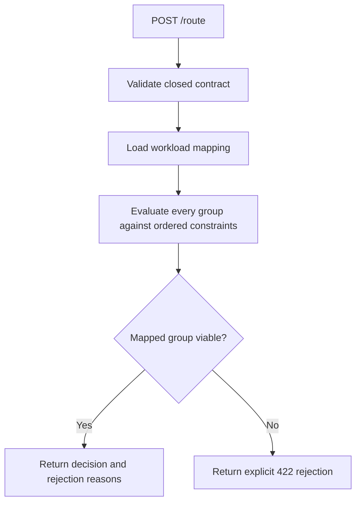

# Policy Model Router

[](https://github.com/brunovicco/policy-model-router/actions/workflows/quality.yml)
[](https://www.python.org/)
[](LICENSE)
[](https://github.com/brunovicco/policy-model-router/pkgs/container/policy-model-router)

Read this in [Português](README.pt-BR.md).

A fail-closed runtime policy enforcement service that selects an approved model group for an LLM
workload before inference.

The router keeps model choice and runtime authorization outside agent prompts and application code.
A caller describes the workload, data classification, context size, and operational limits;
`POST /route` evaluates that request against a versioned policy and returns either an explainable
decision record or an explicit rejection. Governed deployments can additionally require signed
runtime authorization and consume runtime-control state such as a kill switch before a request is
allowed to proceed. It does not call an LLM.

## Why this exists

An enterprise AI system often has several model deployments with different data authorizations,
capabilities, context windows, latency profiles, and costs. Letting every agent choose a model on
its own makes those decisions difficult to govern, reproduce, and audit.

Policy Model Router centralizes that boundary:

- workload-to-model-group mappings are declarative and versioned in
  [`config/routing_policy.yaml`](config/routing_policy.yaml);
- hard constraints eliminate ineligible groups in a fixed order;
- the same request and policy produce the same selected group and rejection reasons;
- every non-selected group is included in the decision with an explanation;
- invalid or incomplete policies fail closed instead of silently falling back;
- the API returns stable, machine-readable error envelopes.

The selected value is a logical model group such as `reasoning-medium`, not a provider or a
deployment. Provider selection, failover, credentials, and the actual inference call belong to a
downstream model gateway.

### Where this sits: the router is the PDP

This service is the **Policy Decision Point**. The companion
[governed-llm-gateway](https://github.com/brunovicco/governed-llm-gateway) is the **Policy
Enforcement Point**: it takes the decision produced here, intersects it with its own deployment
registry, and executes the provider call. The binding between the two is versioned against
`POST /route` wire schema `1.0` and documented on the gateway side in
[`docs/architecture/PDP_PEP_CONTRACT_DRAFT.md`](https://github.com/brunovicco/governed-llm-gateway/blob/main/docs/architecture/PDP_PEP_CONTRACT_DRAFT.md).

The invariant across the pair is one-directional:

```text
Gateway allowed set  ⊆  Policy Router authorized set
```

The gateway may reject more deployments than this router authorized. It may never broaden or
synthesize authorization. That is why a rejection here carries the same provenance as an
acceptance: the enforcement point has to be able to prove *which* policy denied a call, not just
that something did.

Either service runs without the other - this router has no dependency on the gateway, and its
decisions are meaningful to any consumer that honors the same invariant.

## How routing works


```mermaid
flowchart TD
    A["POST /route"] --> B["Validate closed contract"]
    B --> C["Load workload mapping"]
    C --> D["Evaluate every group against ordered constraints"]
    D --> E{"Mapped group viable?"}
    E -->|Yes| F["Return decision and rejection reasons"]
    E -->|No| G["Return explicit 422 rejection"]
```

For each request, the application use case:

1. Finds the model group mapped to the requested workload.
2. Evaluates every configured group against the constraints below, stopping at the first failure
   for each candidate.
3. Selects the mapped group only if it survives every constraint.
4. Reports every other group as rejected, either because it failed a constraint or because the
   workload maps elsewhere.
5. Rejects the request if the mapped group is ineligible. The current version does not substitute
   a different group or apply a weighted score.

Decision IDs and timestamps are generated at runtime; model-group selection and reasons are the
deterministic part of the result.

### Constraint order

Order matters because the first failed constraint becomes that candidate's rejection reason.

| # | Constraint | Candidate is rejected when |
|---:|---|---|
| 1 | Data classification | The group is not authorized for the request's classification |
| 2 | Risk level | The group is not authorized for the request's workflow risk tier |
| 3 | Structured output | The request requires structured output and the group does not support it |
| 4 | Tool calling | The workload requires tool calling and the group does not support it |
| 5 | Context window | Estimated input + expected output tokens together exceed the group's limit |
| 6 | Cost ceiling | Estimated group cost exceeds `max_cost_usd` |
| 7 | Latency ceiling | Typical group latency exceeds `max_latency_ms` |
| 8 | Availability | The provider resolves the group as unavailable (see [Availability](#availability)) |
| 9 | Agent allowlist | The group is restricted and the requesting agent is not listed |

The predicates live in
[`src/policy_model_router/domain/constraints.py`](src/policy_model_router/domain/constraints.py),
and the two-step selection algorithm lives in
[`src/policy_model_router/application/route_model.py`](src/policy_model_router/application/route_model.py).

## Shipped policy

The repository includes an example policy for five workload types and four logical model groups.
Values are deployment-policy inputs, not live provider measurements.

### Workload mappings

| Workload | Mapped model group | Native tool calling required |
|---|---|---:|
| `document_extraction` | `fast-small` | No |
| `cashflow_analysis` | `reasoning-medium` | No |
| `findings_correlation` | `reasoning-strong` | No |
| `opinion_drafting` | `reasoning-strong` | No |
| `json_repair` | `fast-structured-output` | No |

### Model-group profiles

| Model group | Authorized data | Authorized risk | Structured output | Tool calling | Context | Typical latency | Cost (input / output, per M tokens) |
|---|---|---|---:|---:|---:|---:|---:|
| `fast-small` | public, internal | low, medium | No | Yes | 16,000 | 3,000 ms | USD 0.10 / 0.40 |
| `reasoning-medium` | public, internal, confidential, restricted | low, medium, high | No | Yes | 64,000 | 15,000 ms | USD 0.50 / 1.50 |
| `reasoning-strong` | public, internal, confidential, restricted | low, medium, high, critical | No | Yes | 128,000 | 30,000 ms | USD 2.00 / 8.00 |
| `fast-structured-output` | public, internal | low, medium | Yes | No | 8,000 | 2,000 ms | USD 0.10 / 0.40 |

The authorized-risk column reflects a decision-quality rule, not a data-protection one: a group can
be fully cleared for the data involved and still be unauthorized for a high-stakes decision (see
[ADR-0005's amendment](docs/adr/0005-deterministic-policy-routing.md)). All four groups are marked
available and have unrestricted agent allowlists in the shipped policy. Change those values
deliberately for each environment.

Cost figures are this router's own illustrative price-per-token inputs to the deterministic cost
constraint - like `typical_latency_ms`, a static number the policy author maintains, not a live
feed synced from any provider (see [ADR-0010](docs/adr/0010-token-based-cost-estimation.md)).

## Quick start

Requirements: Python 3.13 and [uv](https://docs.astral.sh/uv/).

```bash
git clone https://github.com/brunovicco/policy-model-router.git
cd policy-model-router
uv sync --frozen
export API_KEYS='{"credit-analysis-agent":"dev-local-key"}'   # required; keyed by agent_name
uv run uvicorn policy_model_router.entrypoints.http:app --reload
```

The service starts on `http://127.0.0.1:8000` and loads `config/routing_policy.yaml` once during
startup. Every `POST /route` call needs the `X-API-Key` header shown below; see
[Authentication and rate limiting](#authentication-and-rate-limiting).

### Request a decision

This request contains restricted data and a 100,000-token context, so only the workload's mapped
`reasoning-strong` group remains viable:

```bash
curl --request POST http://127.0.0.1:8000/route \
  --header 'Content-Type: application/json' \
  --header 'X-API-Key: dev-local-key' \
  --data '{
    "schema_version": "1.0",
    "requested_at": "2026-07-22T12:00:00Z",
    "workflow_id": "credit-review-42",
    "task_id": "correlate-findings-7",
    "agent_name": "credit-analysis-agent",
    "workload": "findings_correlation",
    "risk_level": "high",
    "data_classification": "restricted",
    "context_tokens_estimated": 100000,
    "max_output_tokens_estimated": 2000,
    "structured_output_required": false,
    "max_latency_ms": 60000,
    "max_cost_usd": 1.00
  }'
```

Example response:

```json
{
  "schema_version": "1.0",
  "routing_decision_id": "674088f4-cd75-45e9-a6b5-5e85b8cc5588",
  "decided_at": "2026-07-22T12:00:01Z",
  "workflow_id": "credit-review-42",
  "task_id": "correlate-findings-7",
  "selected_model_group": "reasoning-strong",
  "reason": "workload 'findings_correlation' maps to model group 'reasoning-strong' and satisfies all constraints",
  "rejected_candidates": [
    {
      "model_group": "fast-small",
      "reason": "not authorized for data classification 'restricted'",
      "reason_code": "data_classification_not_authorized",
      "observed_value": "restricted",
      "required_value": "public, internal"
    },
    {
      "model_group": "fast-structured-output",
      "reason": "not authorized for data classification 'restricted'",
      "reason_code": "data_classification_not_authorized",
      "observed_value": "restricted",
      "required_value": "public, internal"
    },
    {
      "model_group": "reasoning-medium",
      "reason": "estimated input+output 102000 tokens (input 100000 + output 2000) exceeds group limit of 64000 tokens",
      "reason_code": "context_window_exceeded",
      "observed_value": "102000",
      "required_value": "<= 64000"
    }
  ],
  "policy_id": "credit-desk-routing",
  "policy_version": "1.0.0",
  "policy_digest": "sha256:2f1a...c9",
  "service_version": "0.5.0",
  "environment": "production"
}
```

`policy_id`/`policy_version`/`policy_digest` identify exactly which routing policy produced this
decision (`policy_digest` is a `sha256` hash of the loaded YAML file's decoded text content,
computed at load time - line endings are normalized by Python's text-mode read, so CRLF and LF
variants of the same content hash identically - not hand-maintained, so it changes whenever the
file's content changes even if nobody remembered to bump `policy_version`); `service_version`/
`environment` identify the deployment that produced it. See
[ADR-0009](docs/adr/0009-policy-identity-and-decision-provenance.md).

Each rejected candidate also carries a machine-readable `reason_code` (one per constraint in
[Constraint order](#constraint-order), plus `workload_mapped_elsewhere` for a candidate that passed
every constraint but simply isn't the workload's mapped group) alongside `observed_value`/
`required_value`, so a caller doesn't have to parse `reason`'s free text to build an audit trail or
a UI.

### Hard rejection

`document_extraction` maps to `fast-small`, which is not authorized for confidential data in the
shipped policy. The router does not silently promote the request to a stronger group:

```json
{
  "error": {
    "code": "no_viable_model_group",
    "message": "no viable model group for workload 'document_extraction': mapped group 'fast-small' rejected (not authorized for data classification 'confidential')"
  },
  "decision": {
    "schema_version": "1.0",
    "routing_decision_id": "8f2c1e3a-...",
    "decided_at": "2026-07-23T12:00:01Z",
    "workflow_id": "credit-review-42",
    "task_id": "extract-docs-1",
    "workload": "document_extraction",
    "rejected_model_group": "fast-small",
    "reason": "not authorized for data classification 'confidential'",
    "reason_code": "data_classification_not_authorized",
    "observed_value": "confidential",
    "required_value": "public, internal",
    "policy_id": "credit-desk-routing",
    "policy_version": "1.0.0",
    "policy_digest": "sha256:2f1a...c9",
    "service_version": "0.5.0",
    "environment": "production"
  }
}
```

The response status is `422 Unprocessable Entity`. `error.code`/`error.message` are the original,
stable error envelope; `decision` is additive - a rejection carries exactly the same provenance
(`routing_decision_id`, `decided_at`, and the five policy/deployment identity fields) as an
accepted decision, so it is exactly as auditable (see
[ADR-0009](docs/adr/0009-policy-identity-and-decision-provenance.md)).

## API contract

`POST /route` accepts a closed schema: unknown fields are rejected, identifiers must be non-empty,
timestamps must be timezone-aware UTC values, and numeric limits must be positive.

| Field | Accepted values or rule |
|---|---|
| `schema_version` | Exactly `1.0` |
| `requested_at` | UTC timestamp |
| `workflow_id`, `task_id`, `agent_name` | Non-empty strings, at most 200 characters |
| `workload` | Any policy-defined identifier: 1-128 lowercase characters from `a-z0-9._-`, starting and ending alphanumeric. New workloads must be namespace-qualified (`rag.answer`); the five 0.x credit-desk names remain valid unqualified. A syntactically valid workload the active policy does not declare is **not** rejected by the schema - it reaches the policy boundary and fails closed there (see [ADR-0015](docs/adr/0015-policy-defined-workload-and-model-group-identifiers.md) and [the migration guide](docs/MIGRATION_TO_GENERIC_POLICY.md)) |
| `risk_level` | `low`, `medium`, `high`, or `critical` |
| `data_classification` | `public`, `internal`, `confidential`, or `restricted` |
| `context_tokens_estimated` | Integer between zero and 10,000,000 (input/prompt tokens) |
| `max_output_tokens_estimated` | Integer between zero and 10,000,000 (expected output/completion tokens) |
| `structured_output_required` | Boolean |
| `max_latency_ms` | Positive integer |
| `max_cost_usd` | Positive decimal value |

`context_tokens_estimated` and `max_output_tokens_estimated` both feed the cost constraint: each
model group is priced per token (input and output rates separately - see
[Model-group profiles](#model-group-profiles)), so the estimated cost of a call is a function of
its actual size, not a flat number per group. See
[ADR-0010](docs/adr/0010-token-based-cost-estimation.md).

Stable error codes are:

| HTTP status | Code | Meaning |
|---:|---|---|
| 401 | `unauthorized` | Missing or invalid `X-API-Key` header |
| 413 | `payload_too_large` | Request body exceeds `MAX_REQUEST_BODY_BYTES`, per its declared `Content-Length` |
| 422 | `invalid_request` | The request does not match the contract |
| 422 | `no_viable_model_group` | The workload's mapped group failed a hard constraint |
| 429 | `rate_limit_exceeded` | Too many requests for this `(client IP, agent_name)` pair |
| 403 | *(a bounded runtime denial code)* | Signed runtime authorization or runtime control rejected the request; the body also carries a `violation` envelope (see [Runtime authorization](#runtime-authorization-and-governance-controls)) |
| 500 | `misconfigured_routing_policy` | The active policy declares no rule for the requested workload |

A missing, malformed, unknown-field, or incomplete YAML policy prevents the service from starting.

## Policy configuration

Edit [`config/routing_policy.yaml`](config/routing_policy.yaml) to manage workload mappings and
model-group capabilities. The loader requires complete coverage of every declared workload and
model group and rejects unknown fields.

A model group no workload maps to is rejected too, so configuration cannot be left behind by
accident. Declare `staged: true` on a group you are provisioning deliberately ahead of the workload
that will use it - a canary, a reserve, or a group being prepared for a later cutover. Staging
exempts a group from that reachability check and nothing else: it is still validated in full, and
still unreachable until a workload maps to it.

Send `SIGHUP` to reload the policy without restarting:

```bash
docker kill --signal=HUP <container>      # or: kubectl exec <pod> -- kill -HUP 1
```

The reload is atomic: a request resolves the policy once when it starts and keeps it for its
lifetime, so a decision is always produced by one policy version and the `policy_digest` it
reports is the one that actually decided it. A request already in flight is never affected.

If the new file fails to load, **the running policy is kept** and the service keeps serving.
Refusing to serve would turn a YAML typo into an outage, and a restart would only re-read the same
broken file. The failure increments `policy_model_router_policy_reloads_total{outcome="failed"}`
and emits a `routing_policy_reload_failed` log line carrying the digest still in effect - alert on
that counter rather than assuming a reload worked. Under multiple worker processes each worker
holds its own policy and needs its own signal.

Use `ROUTING_POLICY_PATH` to load an environment-specific file:

```bash
ROUTING_POLICY_PATH=/etc/policy-model-router/routing_policy.yaml \
  uv run uvicorn policy_model_router.entrypoints.http:app --host 0.0.0.0 --port 8000
```

Other runtime settings:

| Environment variable | Default | Purpose |
|---|---|---|
| `APP_ENV` | `development` | Environment label attached to structured logs |
| `LOG_LEVEL` | `INFO` | Python logging level |
| `LOG_FORMAT` | `json` | Use `console` for human-readable local logs |
| `API_KEYS` | *(required)* | JSON object mapping each `agent_name` to its own API key, checked against the `X-API-Key` header on `POST /route`; the service refuses to start if unset, empty, or malformed |
| `RATE_LIMIT_MAX_REQUESTS` | `60` | Requests allowed per `(client IP, agent_name)` pair per window |
| `RATE_LIMIT_WINDOW_SECONDS` | `60` | Rate-limit window length, in seconds, shared by both tiers below; must be greater than `0` and at most `86400` |
| `RATE_LIMIT_PER_IP_MAX_REQUESTS` | `600` | Requests allowed per client IP alone per window, checked before the per-agent tier and before authentication |
| `RATE_LIMIT_MAX_TRACKED_KEYS` | `100000` | In-memory limiter only (ignored once `REDIS_URL` is set): caps distinct keys held in memory per tier, evicting the least-recently-touched one past this limit |
| `REDIS_URL` | *(unset)* | Optional. Shares the rate limit across replicas via Redis (ADR-0008); requires `uv sync --extra rate-limit`. Unset keeps the default in-memory, per-process limiter |
| `RATE_LIMIT_FINGERPRINT_SECRET` | *(unset)* | Redis-backed limiter only. HMAC key for the fail-open log fingerprint; unset uses a random per-process secret instead (stable per process, not across restarts) |
| `MAX_REQUEST_BODY_BYTES` | `16384` | Maximum `POST /route` body size, checked against `Content-Length` before the body is parsed (ADR-0011). A chunked body with no `Content-Length` is not checked - see [ADR-0011](docs/adr/0011-http-boundary-pre-parse-limits.md) |

## Authentication and rate limiting

`POST /route` requires a valid `X-API-Key` header, matched against the key configured for the
request's own `agent_name` in `API_KEYS` (constant-time comparison); a missing key, a wrong key, or
a key that belongs to a different agent all return `401 unauthorized` - the response never reveals
which agent names are configured. One agent's key can be rotated or revoked without affecting any
other agent. This is still not full IAM: there is no key expiry, scoping beyond "may call `/route`
as this agent," or identity assurance stronger than "knew the right key" - see
[ADR-0007's amendment](docs/adr/0007-http-boundary-hardening.md) for what a stronger mechanism
(mTLS, OAuth2 client credentials) would add.

It is also rate-limited on two tiers, both checked *before* authentication so repeated
invalid-API-key attempts are throttled too: a light per-client-IP tier
(`RATE_LIMIT_PER_IP_MAX_REQUESTS` per `RATE_LIMIT_WINDOW_SECONDS`), then a per-`(IP, agent_name)`
tier (`RATE_LIMIT_MAX_REQUESTS`) - the first tier exists specifically so a caller cannot dodge the
second merely by varying the `agent_name` it sends on every request. The per-IP tier runs in ASGI
middleware, before FastAPI even parses the request body (ADR-0011), so a malformed or oversized
body still counts against it; the per-agent tier still runs inside the handler, after parsing,
since it needs `agent_name` from the body. Exceeding either tier returns `429 rate_limit_exceeded`. By default both are in-memory, fixed-window counters, **per process**,
each bounded to `RATE_LIMIT_MAX_TRACKED_KEYS` distinct keys - a multi-instance deployment enforces
the limit per instance, not cluster-wide (ADR-0007). Set `REDIS_URL` (and install
`uv sync --extra rate-limit`) to share both tiers across replicas instead; run
`docker compose up -d redis` for a local instance. The Redis-backed limiter fails open on a backend
error (it allows the request rather than blocking routing traffic on an unrelated outage) but fails
the service closed at startup if the configured Redis is unreachable (ADR-0008). Its fail-open log
line never includes the raw key (which embeds the caller's IP) - only an HMAC-keyed fingerprint, so
an operator can correlate repeated failures without an attacker with log access being able to
enumerate and match the low-entropy `(IP, agent_name)` space against an unkeyed hash (see
[ADR-0008's third amendment](docs/adr/0008-redis-shared-rate-limiter.md)).

The rate-limit key's IP component is always the raw TCP peer address - this service never reads
`X-Forwarded-For`/`Forwarded`. Behind a reverse proxy, every real client shares the proxy's IP,
collapsing per-client granularity to one shared bucket; if you need real per-client granularity in
that topology, configure the proxy to pass a trusted header and configure Uvicorn/Starlette to
trust only that specific hop (e.g. `--forwarded-allow-ips` scoped to the proxy's address) - never
trust forwarded headers from an unrestricted set of peers, or any client could forge the header and
multiply its quota. See [ADR-0008's second amendment](docs/adr/0008-redis-shared-rate-limiter.md)
for the full rationale.

## Runtime authorization and governance controls

Everything above is the router's own policy boundary. A governed deployment can additionally
require that each request arrive inside a **signed runtime scope** issued by an external Governance
authority, and that an emergency stop be honored before any decision is made. Both are **off by
default** and **mandatory in `staging`/`production`** - `APP_ENV` in those values with
`RUNTIME_AUTHORIZATION_REQUIRED=false` refuses to start.

When enforcement is on, `POST /route` takes a wrapped body instead of the bare request:

```json
{
  "request": { "schema_version": "1.0", "workload": "cashflow_analysis", "...": "..." },
  "authorization": {
    "protected": { "typ": "application/vnd.verifiable-ai-governance.runtime-authorization+json",
                   "alg": "Ed25519", "kid": "governance-key-2026a" },
    "claims": { "authorization_id": "...", "issuer": "...", "audience": ["policy-model-router"],
                "issued_at": "...", "not_before": "...", "expires_at": "...",
                "subject": { "agent_id": "...", "agent_version": 3, "...": "..." },
                "request": { "workflow_id": "...", "task_id": "...", "workload": "...",
                             "max_cost_usd_micros": 1000000, "...": "..." },
                "scope": { "risk_tier": "high", "data_classification": "restricted",
                           "autonomy_level": "a2_prepare_for_approval",
                           "models": [{ "routing_group": "reasoning-strong",
                                        "allowed_data_classes": ["restricted"], "...": "..." }],
                           "kill_switch_enabled": true, "...": "..." },
                "scope_digest": "<sha256 hex>",
                "policy": { "policy_id": "...", "policy_digest": "<sha256 hex>", "...": "..." } },
    "signature": "<unpadded base64url of 64 Ed25519 bytes>"
  }
}
```

The envelope is verified before routing and re-checked after it. In order:

1. **Identity and time** - issuer, audience, `issued_at`/`not_before`/`expires_at`, bounded to a
   ten-minute maximum lifetime.
2. **Key** - resolved by exact `kid` against a public-only trusted key set, with no fallback;
   revoked keys and closed verification windows are rejected.
3. **Signature** - Ed25519 over canonical JSON of `{protected, claims}`, so the signing bytes stay
   byte-for-byte compatible with the issuing repository.
4. **Request binding** - eleven request facts must match the signed claims, so an authorization
   cannot be replayed against a different, cheaper, or lower-risk request.
5. **Agent binding** - the calling `agent_name` must map to the signed Governance `agent_id`.
6. **Policy provenance** - the signed policy and control-catalog IDs, versions, and digests must be
   the ones this deployment trusts.
7. **Runtime control** - the kill switch and the revocation floor, read from a Governance
   projection (see below).
8. **Single use** - the `authorization_id` is atomically consumed; a replay is denied.
9. **Selected model** - *after* routing, the group this router selected must itself appear in the
   signed scope and be signed for the request's data classification.

Every step fails closed with a bounded, machine-readable code, and a denial returns `403` carrying
a content-minimized `violation` envelope - a digest-bound event with the category, the code, the
authorization state, and structural identifiers only. It never copies prompts, headers, credentials,
or request content.

```json
{
  "error": { "code": "selected_model_group_not_authorized",
             "message": "runtime authorization denied" },
  "violation": {
    "event": { "schema_version": "1.0", "event_id": "...", "occurred_at": "...",
               "source_service": "policy-model-router", "enforcement_action": "blocked",
               "category": "model_scope", "code": "selected_model_group_not_authorized",
               "correlation_id": "...", "authorization": { "state": "verified", "...": "..." },
               "request": { "workflow_id": "...", "task_id": "...", "agent_name": "...",
                            "workload": "..." },
               "selected_model_group": "reasoning-strong" },
    "event_digest": "<sha256 hex>"
  }
}
```

Violation categories are `authorization`, `replay`, `request_binding`, `governance_provenance`, and
`model_scope`. The denial codes are listed in
[`docs/runtime-authorization-operations.md`](docs/runtime-authorization-operations.md).

### Runtime control: kill switch and revocation floor

`RUNTIME_CONTROL_REQUIRED=true` makes the router read a Governance-owned, read-only Redis
projection before consuming the authorization. It denies when the snapshot says the kill switch is
engaged, when the signed agent version is at or below the revocation floor, or when the projection
is missing or unreachable - the absence of state is a denial, not a default-allow. Runtime control
requires signed runtime authorization; enabling it alone is a startup error. See
[`docs/runtime-kill-switch-enforcement.md`](docs/runtime-kill-switch-enforcement.md) and its
[threat model](docs/runtime-kill-switch-threat-model.md).

### Settings

All of these are optional while enforcement is off. Operational values and a rollout order are in
[`docs/runtime-authorization-operations.md`](docs/runtime-authorization-operations.md).

| Environment variable | Default | Purpose |
|---|---|---|
| `RUNTIME_AUTHORIZATION_REQUIRED` | `false` | Master switch. Must be `true` in `staging`/`production` |
| `RUNTIME_AUTHORIZATION_ISSUER` | `verifiable-ai-governance:production` | Trusted signer identity |
| `RUNTIME_AUTHORIZATION_AUDIENCE` | `policy-model-router` | This service's audience value |
| `RUNTIME_AUTHORIZATION_TRUSTED_KEY_SET_PATH` | *(unset)* | Public-only Ed25519 key set; required when enforcement is on |
| `RUNTIME_AUTHORIZATION_AGENT_BINDINGS_JSON` | `{}` | JSON object mapping `agent_name` to its Governance agent UUID |
| `RUNTIME_AUTHORIZATION_EXPECTED_POLICY_ID` | `baseline-governance-policy` | Governance policy identity this deployment trusts |
| `RUNTIME_AUTHORIZATION_EXPECTED_POLICY_VERSION` | `1.0.0` | Trusted Governance policy version |
| `RUNTIME_AUTHORIZATION_EXPECTED_POLICY_DIGEST` | *(unset)* | Lowercase SHA-256; required when enforcement is on |
| `RUNTIME_AUTHORIZATION_EXPECTED_CONTROL_CATALOG_ID` | `verifiable-ai-governance-baseline` | Trusted control catalog identity |
| `RUNTIME_AUTHORIZATION_EXPECTED_CONTROL_CATALOG_VERSION` | `1.0.0` | Trusted control catalog version |
| `RUNTIME_AUTHORIZATION_EXPECTED_CONTROL_CATALOG_DIGEST` | *(unset)* | Lowercase SHA-256; required when enforcement is on |
| `RUNTIME_AUTHORIZATION_CLOCK_SKEW_SECONDS` | `0` | Allowed skew, `0`-`60` |
| `RUNTIME_AUTHORIZATION_MAX_KEY_SET_BYTES` | `262144` | Bound on the key-set file |
| `RUNTIME_AUTHORIZATION_REPLAY_KEY_PREFIX` | `policy-model-router:runtime-auth:` | Redis namespace for replay consumption |
| `RUNTIME_AUTHORIZATION_REPLAY_MAX_ENTRIES` | `10000` | In-memory replay guard bound (local/test only; `REDIS_URL` is required in `staging`/`production`) |
| `RUNTIME_CONTROL_REQUIRED` | `false` | Enforce the kill switch and revocation floor. Must be `true` in `staging`/`production` |
| `RUNTIME_CONTROL_REDIS_KEY_PREFIX` | `verifiable-ai-governance:runtime-control:v1:agent:` | Namespace shared with Governance |
| `RUNTIME_CONTROL_MAX_SNAPSHOT_BYTES` | `4096` | Bound on one projection snapshot |
| `RUNTIME_CONTROL_TIMEOUT_SECONDS` | `2.0` | Redis connect/read timeout for the projection |

Distributed tracing across this boundary continues the caller's W3C trace context; see
[`docs/runtime-tracing.md`](docs/runtime-tracing.md).

## Availability

`ModelGroupProfile.available` in `config/routing_policy.yaml` is a static, hand-edited flag. The
application layer resolves it through an `AvailabilityProvider` port
([ADR-0006](docs/adr/0006-availability-provider-port.md)); the only implementation shipped today,
`StaticAvailabilityProvider`, passes that flag through unchanged. There is no live provider/gateway
health check yet - the port exists so one can be added later as a new adapter, without changing the
routing use case or the domain constraints.

The port resolves the whole candidate set in a single call per request, so an adapter that does
real I/O can batch, cache and bound one timeout across every group instead of paying those costs
per group. A group such an adapter omits from its answer is treated as unavailable rather than
falling back to the policy's flag: a degraded provider must not end up more permissive than an
explicit denial.

## Health, readiness, and metrics

`GET /health` always returns `200 {"status": "ok"}` once the process is serving requests. `GET
/readyz` returns `200 {"status": "ready"}` once the routing policy loaded successfully at startup.
`GET /metrics` returns Prometheus-format output (plus the default process/Python metrics the
`prometheus_client` registry always exposes), including:

| Metric | Type | Labels | Meaning |
|---|---|---|---|
| `policy_model_router_route_decisions_total` | Counter | `workload`, `model_group` | Successful routing decisions |
| `policy_model_router_route_rejections_total` | Counter | `workload`, `outcome` | Requests that did not produce a decision (`no_viable_model_group`, `misconfigured_policy`) |
| `policy_model_router_route_duration_seconds` | Histogram | `workload` | Time spent evaluating one routing decision |
| `policy_model_router_rate_limit_decisions_total` | Counter | `tier` (`per_ip`, `per_agent`), `outcome` (`allowed`, `blocked`) | Rate limiter admit/block decisions |
| `policy_model_router_rate_limiter_backend_unavailable_total` | Counter | - | Requests where the Redis-backed rate limiter failed open because Redis was unreachable |
| `policy_model_router_runtime_authorization_total` | Counter | `outcome` (`verified`, `denied`, `legacy_dev`) | Signed runtime authorization checks |
| `policy_model_router_runtime_violations_total` | Counter | `category`, `code` | Fail-closed runtime violations, by bounded category and reason code |
| `policy_model_router_policy_reloads_total` | Counter | `outcome` (`succeeded`, `failed`) | Routing-policy reload attempts |

Alert on `increase(policy_model_router_rate_limiter_backend_unavailable_total[5m]) > 0` (summed
across replicas) to catch a sustained Redis outage instead of relying on the
`rate_limiter_backend_unavailable` log line alone.

The `workload` label carries the requested workload only when the active policy declares it. Since
workloads became caller-supplied identifiers (ADR-0015), any other value would be unbounded
cardinality, so every undeclared workload is reported as `workload="undeclared"`. The structured
logs still carry the verbatim value for debugging.

Every `POST /route` call also emits a structured `routing_decision` log line (`outcome=accepted` or
`outcome=rejected`) carrying `routing_decision_id`, `correlation_id`, `workload`, the relevant
model group, `reason_code` (rejections only), the policy identity fields, and `duration_ms`.
Caller-supplied `workflow_id` and `task_id` remain in the request/response contract but are not
logged, per `docs/PRIVACY.md`. This is a log line, not a durable audit store; see [ADR-0009's amendment](docs/adr/0009-policy-identity-and-decision-provenance.md).

None of the three endpoints in this section requires `X-API-Key` or counts against the rate limit,
so orchestrators and scrapers can probe them cheaply. `/readyz` is a shallow check: it does not
probe Redis even when `REDIS_URL` is configured,
so "ready" means "startup completed, including a successful Redis connectivity check at that
moment," not "Redis is healthy right now."

None of the three is restricted at the network layer by this repository - that's an ingress/mesh
concern, the same way deploying `/route` behind an authenticated gateway is. In production,
restrict `/metrics` (and, more loosely, `/health`/`/readyz`) to internal scrapers/orchestrators.

## Container

Build and run the non-root, multi-stage image. `API_KEYS` is required - the service refuses to
start without it, in the container the same as anywhere else:

```bash
docker build -t policy-model-router .
docker run --rm -p 8000:8000 \
  -e API_KEYS='{"credit-analysis-agent":"dev-local-key"}' \
  policy-model-router
```

Mount a custom `routing_policy.yaml` and point `ROUTING_POLICY_PATH` at it to override the shipped
policy; set `REDIS_URL` (already includes the `rate-limit` extra, so no extra install step is
needed) to share rate limiting across replicas - see
[Policy configuration](#policy-configuration) and [Authentication and rate limiting](#authentication-and-rate-limiting).

SemVer tags trigger the repository's publish workflow, which builds the image and pushes its
versioned tags to GitHub Container Registry after the quality gate passes.

## Architecture

The code follows a Clean Architecture dependency direction:

```text
entrypoints -> application -> domain
adapters    -> application/domain
domain      -> no outer layer
```

- `domain`: controlled vocabularies (data classification, risk level, reason codes), validated
  policy-defined identifiers, policy value objects, routing requests and decisions, and pure
  constraint predicates;
- `application`: deterministic routing use case and clock/ID/availability ports;
- `adapters`: YAML policy loader, system clock, UUID generator, static availability provider, and
  an in-memory rate limiter (default) plus an optional Redis-backed rate limiter;
- `entrypoints`: Pydantic wire contracts, FastAPI endpoints (`/route`, `/health`, `/readyz`,
  `/metrics`), settings, error mapping, and structured logging.

The runtime enforcement modules follow the same direction: the trusted key set and kill-switch
state are domain values, the verifier and the control enforcer are application use cases behind
ports, the replay guards and projection stores are adapters, and the wire contracts stay in
`entrypoints`. The one deliberate exception is the signed Governance envelope, which lives in
`application` rather than `domain`: it is a Pydantic contract whose canonical signing bytes must
stay byte-for-byte compatible with the issuing repository.

The policy is loaded at startup, re-read on `SIGHUP`, and request handling is stateless. See
[`docs/ARCHITECTURE.md`](docs/ARCHITECTURE.md) for the dependency rules and diagrams, and the
[ADR index](docs/ARCHITECTURE.md#related-decisions) for why the provider boundary
([ADR-0004](docs/adr/0004-litellm-provider-boundary.md)), the routing algorithm
([ADR-0005](docs/adr/0005-deterministic-policy-routing.md)), the availability seam
([ADR-0006](docs/adr/0006-availability-provider-port.md)), the HTTP boundary hardening
([ADR-0007](docs/adr/0007-http-boundary-hardening.md)), the optional shared rate limiter
([ADR-0008](docs/adr/0008-redis-shared-rate-limiter.md)), decision provenance
([ADR-0009](docs/adr/0009-policy-identity-and-decision-provenance.md)), token-based cost
estimation ([ADR-0010](docs/adr/0010-token-based-cost-estimation.md)), the pre-parse HTTP limits
([ADR-0011](docs/adr/0011-http-boundary-pre-parse-limits.md)), signed runtime authorization
([ADR-0012](docs/adr/0012-signed-runtime-authorization.md)), structured violation evidence
([ADR-0013](docs/adr/0013-structured-runtime-violation-evidence.md)), W3C trace continuation
([ADR-0013, tracing](docs/adr/0013-w3c-runtime-trace-context.md)), kill-switch enforcement
([ADR-0014](docs/adr/0014-runtime-kill-switch-enforcement.md)), and policy-defined workload and
model-group identifiers
([ADR-0015](docs/adr/0015-policy-defined-workload-and-model-group-identifiers.md)) look the way
they do.

## Current scope

The MVP intentionally does not:

- choose a provider, deployment, or API credential;
- call a model or run a live health check against a provider/gateway; availability is resolved
  through the `AvailabilityProvider` port, but the only shipped implementation still passes through
  the static YAML flag (see [Availability](#availability));
- score or rank viable alternatives;
- fall back when the workload's mapped group is rejected;
- provide full IAM: per-agent `API_KEYS` authenticate a claimed `agent_name` but have no expiry,
  scoping, or identity assurance beyond "knew the right key" (see
  [Authentication and rate limiting](#authentication-and-rate-limiting)). Signed runtime
  authorization is the stronger boundary and is available today, but it authenticates the
  *Governance scope of a request*, not the transport caller - it does not replace mTLS or OAuth2
  client credentials at the edge;
- watch the policy file, or reload it on its own: a reload happens when an operator sends `SIGHUP`
  (see [Policy configuration](#policy-configuration)), never automatically;
- share rate-limit state across replicas *by default*; that requires opting into `REDIS_URL`, which
  in turn adds Redis as a real infrastructure dependency with its own availability to manage.

These boundaries keep policy decisions explicit. Add fallback, scoring, a live health check, or
per-agent/shared-state auth and rate limiting only when there is evaluation data or a concrete
deployment requirement to justify the behavior. See
[`docs/ARCHITECTURE.md`](docs/ARCHITECTURE.md#known-gaps) for the full list of tracked gaps.

## Development

Run the test suite:

```bash
uv run pytest
```

Run formatting, linting, typing, tests, security checks, dependency audit, architecture checks,
and packaging through the project gate:

```bash
uv run python scripts/quality_gate.py
```

List available checks or run one in isolation:

```bash
uv run python scripts/quality_gate.py --list
uv run python scripts/quality_gate.py --check tests
```

Additional engineering guidance is available in [`AGENTS.md`](AGENTS.md) and
[`docs/DEVELOPMENT.md`](docs/DEVELOPMENT.md).
