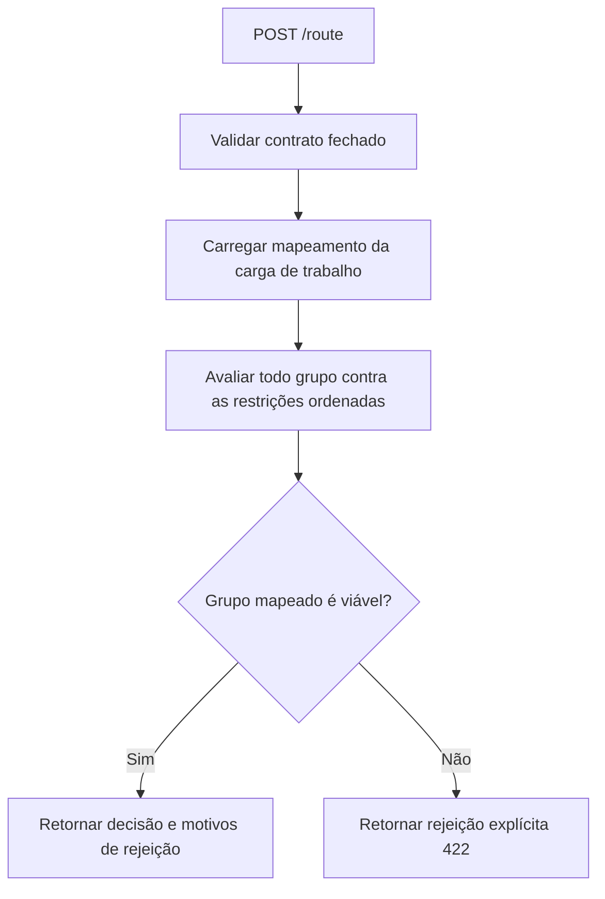

# Policy Model Router

[](https://github.com/brunovicco/policy-model-router/actions/workflows/quality.yml)
[](https://www.python.org/)

Read this in [English](README.md).

Um serviço de roteamento determinístico e *fail-closed* que seleciona um grupo de modelo aprovado
para uma carga de trabalho de LLM antes da inferência.

O roteador mantém a escolha do modelo fora dos prompts dos agentes e do código de aplicação. Um
chamador descreve a carga de trabalho, a classificação de dados, o tamanho de contexto e os
limites operacionais; `POST /route` avalia essa requisição contra uma política versionada e
retorna um registro de decisão explicável ou uma rejeição explícita. O serviço não chama um LLM.

## Por que este projeto existe

Um sistema de IA corporativo costuma ter vários deployments de modelo com diferentes autorizações
de dados, capacidades, janelas de contexto, perfis de latência e custos. Deixar cada agente
escolher um modelo por conta própria torna essas decisões difíceis de governar, reproduzir e
auditar.

O Policy Model Router centraliza essa fronteira:

- os mapeamentos de carga de trabalho para grupo de modelo são declarativos e versionados em
  [`config/routing_policy.yaml`](config/routing_policy.yaml);
- restrições rígidas eliminam grupos inelegíveis em uma ordem fixa;
- a mesma requisição e a mesma política sempre produzem o mesmo grupo selecionado e os mesmos
  motivos de rejeição;
- todo grupo não selecionado é incluído na decisão com uma explicação;
- políticas inválidas ou incompletas falham de forma fechada (*fail-closed*) em vez de degradar
  silenciosamente;
- a API retorna envelopes de erro estáveis e legíveis por máquina.

O valor selecionado é um grupo de modelo lógico, como `reasoning-medium`, não um provedor ou um
deployment específico. A seleção de provedor, o failover, as credenciais e a chamada de inferência
em si pertencem a um gateway de modelos posterior na cadeia.

## Como o roteamento funciona



Para cada requisição, o caso de uso da camada de aplicação:

1. Localiza o grupo de modelo mapeado para a carga de trabalho requisitada.
2. Avalia todos os grupos configurados contra as restrições abaixo, parando na primeira falha para
   cada candidato.
3. Seleciona o grupo mapeado somente se ele sobreviver a todas as restrições.
4. Reporta todo outro grupo como rejeitado, seja porque falhou em uma restrição, seja porque a
   carga de trabalho mapeia para outro grupo.
5. Rejeita a requisição se o grupo mapeado for inelegível. A versão atual não substitui por um
   grupo diferente nem aplica uma pontuação ponderada.

IDs de decisão e timestamps são gerados em tempo de execução; a seleção do grupo de modelo e os
motivos são a parte determinística do resultado.

### Ordem das restrições

A ordem importa porque a primeira restrição que falha se torna o motivo de rejeição daquele
candidato.

| # | Restrição | O candidato é rejeitado quando |
|---:|---|---|
| 1 | Classificação de dados | O grupo não é autorizado para a classificação da requisição |
| 2 | Nível de risco | O grupo não é autorizado para o nível de risco do fluxo de trabalho da requisição |
| 3 | Saída estruturada | A requisição exige saída estruturada e o grupo não suporta |
| 4 | Chamada de ferramentas | A carga de trabalho exige *tool calling* e o grupo não suporta |
| 5 | Janela de contexto | Os tokens de entrada estimados somados aos de saída esperados excedem o limite do grupo |
| 6 | Teto de custo | O custo estimado do grupo excede `max_cost_usd` |
| 7 | Teto de latência | A latência típica do grupo excede `max_latency_ms` |
| 8 | Disponibilidade | O provedor resolve o grupo como indisponível (veja [Disponibilidade](#disponibilidade)) |
| 9 | Lista de agentes permitidos | O grupo é restrito e o agente requisitante não está na lista |

Os predicados vivem em
[`src/policy_model_router/domain/constraints.py`](src/policy_model_router/domain/constraints.py),
e o algoritmo de seleção em dois passos vive em
[`src/policy_model_router/application/route_model.py`](src/policy_model_router/application/route_model.py).

## Política incluída

O repositório inclui uma política de exemplo para cinco tipos de carga de trabalho e quatro grupos
de modelo lógicos. Os valores são entradas de política de deployment, não medições em tempo real de
provedor.

### Mapeamentos de carga de trabalho

| Carga de trabalho | Grupo de modelo mapeado | Exige *tool calling* nativo |
|---|---|---:|
| `document_extraction` | `fast-small` | Não |
| `cashflow_analysis` | `reasoning-medium` | Não |
| `findings_correlation` | `reasoning-strong` | Não |
| `opinion_drafting` | `reasoning-strong` | Não |
| `json_repair` | `fast-structured-output` | Não |

### Perfis dos grupos de modelo

| Grupo de modelo | Dados autorizados | Risco autorizado | Saída estruturada | Tool calling | Contexto | Latência típica | Custo (entrada / saída, por M tokens) |
|---|---|---|---:|---:|---:|---:|---:|
| `fast-small` | public, internal | low, medium | Não | Sim | 16.000 | 3.000 ms | USD 0,10 / 0,40 |
| `reasoning-medium` | public, internal, confidential, restricted | low, medium, high | Não | Sim | 64.000 | 15.000 ms | USD 0,50 / 1,50 |
| `reasoning-strong` | public, internal, confidential, restricted | low, medium, high, critical | Não | Sim | 128.000 | 30.000 ms | USD 2,00 / 8,00 |
| `fast-structured-output` | public, internal | low, medium | Sim | Não | 8.000 | 2.000 ms | USD 0,10 / 0,40 |

A coluna de risco autorizado reflete uma regra de qualidade da decisão, não de proteção de dados:
um grupo pode estar totalmente autorizado para os dados envolvidos e ainda assim não ser autorizado
para uma decisão de alto risco (veja a [emenda da ADR-0005](docs/adr/0005-deterministic-policy-routing.md)).
Os quatro grupos estão marcados como disponíveis e sem restrição de lista de agentes na política
incluída. Altere esses valores deliberadamente para cada ambiente.

Os valores de custo são estimativas próprias deste roteador, usadas como entrada da restrição
determinística de custo - assim como `typical_latency_ms`, são números estáticos mantidos pelo
autor da política, não um feed de preços sincronizado com nenhum provedor (veja a
[ADR-0010](docs/adr/0010-token-based-cost-estimation.md)).

## Início rápido

Requisitos: Python 3.13 e [uv](https://docs.astral.sh/uv/).

```bash
git clone https://github.com/brunovicco/policy-model-router.git
cd policy-model-router
uv sync --frozen
export API_KEYS='{"credit-analysis-agent":"dev-local-key"}'   # obrigatório; indexado por agent_name
uv run uvicorn policy_model_router.entrypoints.http:app --reload
```

O serviço inicia em `http://127.0.0.1:8000` e carrega `config/routing_policy.yaml` uma única vez
na inicialização. Toda chamada a `POST /route` precisa do header `X-API-Key` mostrado abaixo; veja
[Autenticação e rate limiting](#autenticação-e-rate-limiting).

### Solicitando uma decisão

Esta requisição contém dados restritos e um contexto de 100.000 tokens, então apenas o grupo
`reasoning-strong` mapeado para a carga de trabalho permanece viável:

```bash
curl --request POST http://127.0.0.1:8000/route \
  --header 'Content-Type: application/json' \
  --header 'X-API-Key: dev-local-key' \
  --data '{
    "schema_version": "1.0",
    "requested_at": "2026-07-22T12:00:00Z",
    "workflow_id": "credit-review-42",
    "task_id": "correlate-findings-7",
    "agent_name": "credit-analysis-agent",
    "workload": "findings_correlation",
    "risk_level": "high",
    "data_classification": "restricted",
    "context_tokens_estimated": 100000,
    "max_output_tokens_estimated": 2000,
    "structured_output_required": false,
    "max_latency_ms": 60000,
    "max_cost_usd": 1.00
  }'
```

Exemplo de resposta:

```json
{
  "schema_version": "1.0",
  "routing_decision_id": "674088f4-cd75-45e9-a6b5-5e85b8cc5588",
  "decided_at": "2026-07-22T12:00:01Z",
  "workflow_id": "credit-review-42",
  "task_id": "correlate-findings-7",
  "selected_model_group": "reasoning-strong",
  "reason": "workload 'findings_correlation' maps to model group 'reasoning-strong' and satisfies all constraints",
  "rejected_candidates": [
    {
      "model_group": "fast-small",
      "reason": "not authorized for data classification 'restricted'",
      "reason_code": "data_classification_not_authorized",
      "observed_value": "restricted",
      "required_value": "public, internal"
    },
    {
      "model_group": "fast-structured-output",
      "reason": "not authorized for data classification 'restricted'",
      "reason_code": "data_classification_not_authorized",
      "observed_value": "restricted",
      "required_value": "public, internal"
    },
    {
      "model_group": "reasoning-medium",
      "reason": "estimated input+output 102000 tokens (input 100000 + output 2000) exceeds group limit of 64000 tokens",
      "reason_code": "context_window_exceeded",
      "observed_value": "102000",
      "required_value": "<= 64000"
    }
  ],
  "policy_id": "credit-desk-routing",
  "policy_version": "1.0.0",
  "policy_digest": "sha256:2f1a...c9",
  "service_version": "0.2.0",
  "environment": "production"
}
```

`policy_id`/`policy_version`/`policy_digest` identificam exatamente qual política de roteamento
produziu esta decisão (`policy_digest` é um hash `sha256` do conteúdo textual decodificado do YAML
carregado, calculado no momento do carregamento - as quebras de linha são normalizadas pela leitura
em modo texto do Python, então variantes CRLF e LF do mesmo conteúdo geram o mesmo hash - não é
mantido manualmente, então muda sempre que o conteúdo do arquivo muda, mesmo que ninguém tenha
lembrado de incrementar `policy_version`); `service_version`/`environment` identificam o deployment
que a produziu. Veja a
[ADR-0009](docs/adr/0009-policy-identity-and-decision-provenance.md).

Cada candidato rejeitado também carrega um `reason_code` legível por máquina (um por restrição em
[Ordem das restrições](#ordem-das-restrições), mais `workload_mapped_elsewhere` para um candidato
que passou em todas as restrições mas simplesmente não é o grupo mapeado para a carga de trabalho),
junto com `observed_value`/`required_value`, para que o chamador não precise interpretar o texto
livre de `reason` para montar uma trilha de auditoria ou uma UI.

### Rejeição rígida

`document_extraction` mapeia para `fast-small`, que não é autorizado para dados confidenciais na
política incluída. O roteador não promove silenciosamente a requisição para um grupo mais forte:

```json
{
  "error": {
    "code": "no_viable_model_group",
    "message": "no viable model group for workload 'document_extraction': mapped group 'fast-small' rejected (not authorized for data classification 'confidential')"
  },
  "decision": {
    "schema_version": "1.0",
    "routing_decision_id": "8f2c1e3a-...",
    "decided_at": "2026-07-23T12:00:01Z",
    "workflow_id": "credit-review-42",
    "task_id": "extract-docs-1",
    "workload": "document_extraction",
    "rejected_model_group": "fast-small",
    "reason": "not authorized for data classification 'confidential'",
    "reason_code": "data_classification_not_authorized",
    "observed_value": "confidential",
    "required_value": "public, internal",
    "policy_id": "credit-desk-routing",
    "policy_version": "1.0.0",
    "policy_digest": "sha256:2f1a...c9",
    "service_version": "0.2.0",
    "environment": "production"
  }
}
```

O status da resposta é `422 Unprocessable Entity`. `error.code`/`error.message` são o envelope de
erro original e estável; `decision` é aditivo - uma rejeição carrega exatamente a mesma proveniência
(`routing_decision_id`, `decided_at` e os cinco campos de identidade da política/deployment) que uma
decisão aceita, portanto é igualmente auditável (veja a
[ADR-0009](docs/adr/0009-policy-identity-and-decision-provenance.md)).

## Contrato da API

`POST /route` aceita um schema fechado: campos desconhecidos são rejeitados, identificadores devem
ser strings não vazias, timestamps devem ser valores UTC com timezone e os limites numéricos devem
ser positivos.

| Campo | Valores aceitos ou regra |
|---|---|
| `schema_version` | Exatamente `1.0` |
| `requested_at` | Timestamp UTC |
| `workflow_id`, `task_id`, `agent_name` | Strings não vazias |
| `workload` | `document_extraction`, `cashflow_analysis`, `findings_correlation`, `opinion_drafting` ou `json_repair` |
| `risk_level` | `low`, `medium`, `high` ou `critical` |
| `data_classification` | `public`, `internal`, `confidential` ou `restricted` |
| `context_tokens_estimated` | Inteiro maior ou igual a zero (tokens de entrada/prompt) |
| `max_output_tokens_estimated` | Inteiro maior ou igual a zero (tokens de saída/completion esperados) |
| `structured_output_required` | Booleano |
| `max_latency_ms` | Inteiro positivo |
| `max_cost_usd` | Valor decimal positivo |

`context_tokens_estimated` e `max_output_tokens_estimated` alimentam a restrição de custo: cada
grupo de modelo é precificado por token (taxas separadas para entrada e saída - veja
[Perfis dos grupos de modelo](#perfis-dos-grupos-de-modelo)), então o custo estimado de uma chamada
é função do seu tamanho real, não um número fixo por grupo. Veja a
[ADR-0010](docs/adr/0010-token-based-cost-estimation.md).

Os códigos de erro estáveis são:

| Status HTTP | Código | Significado |
|---:|---|---|
| 401 | `unauthorized` | Header `X-API-Key` ausente ou inválido |
| 422 | `invalid_request` | A requisição não corresponde ao contrato |
| 422 | `no_viable_model_group` | O grupo mapeado para a carga de trabalho falhou em uma restrição rígida |
| 429 | `rate_limit_exceeded` | Excesso de requisições para o par `(IP do cliente, agent_name)` |
| 500 | `misconfigured_routing_policy` | A política em execução não tem mapeamento para uma carga de trabalho reconhecida |

Uma política YAML ausente, malformada, com campos desconhecidos ou incompleta impede o serviço de
iniciar.

## Configuração da política

Edite [`config/routing_policy.yaml`](config/routing_policy.yaml) para gerenciar os mapeamentos de
carga de trabalho e as capacidades dos grupos de modelo. O carregador exige cobertura completa de
toda carga de trabalho e grupo de modelo declarado, e rejeita campos desconhecidos.

Use `ROUTING_POLICY_PATH` para carregar um arquivo específico de ambiente:

```bash
ROUTING_POLICY_PATH=/etc/policy-model-router/routing_policy.yaml \
  uv run uvicorn policy_model_router.entrypoints.http:app --host 0.0.0.0 --port 8000
```

Outras configurações de runtime:

| Variável de ambiente | Padrão | Finalidade |
|---|---|---|
| `APP_ENV` | `development` | Rótulo de ambiente anexado aos logs estruturados |
| `LOG_LEVEL` | `INFO` | Nível de logging do Python |
| `LOG_FORMAT` | `json` | Use `console` para logs locais legíveis por humanos |
| `API_KEYS` | *(obrigatória)* | Objeto JSON mapeando cada `agent_name` à sua própria chave, comparada ao header `X-API-Key` em `POST /route`; o serviço recusa iniciar se estiver ausente, vazia ou malformada |
| `RATE_LIMIT_MAX_REQUESTS` | `60` | Requisições permitidas por par `(IP do cliente, agent_name)` por janela |
| `RATE_LIMIT_WINDOW_SECONDS` | `60` | Duração da janela de rate limit, em segundos, compartilhada pelos dois níveis abaixo |
| `RATE_LIMIT_PER_IP_MAX_REQUESTS` | `600` | Requisições permitidas por IP do cliente isoladamente por janela, verificado antes do nível por agente e antes da autenticação |
| `RATE_LIMIT_MAX_TRACKED_KEYS` | `100000` | Só para o limitador em memória (ignorado quando `REDIS_URL` está definida): limita quantas chaves distintas ficam em memória por nível, descartando a menos usada recentemente ao ultrapassar o limite |
| `REDIS_URL` | *(ausente)* | Opcional. Compartilha o rate limit entre réplicas via Redis (ADR-0008); requer `uv sync --extra rate-limit`. Se ausente, mantém o limitador padrão em memória, por processo |
| `RATE_LIMIT_FINGERPRINT_SECRET` | *(ausente)* | Só para o limitador com Redis. Chave HMAC para o fingerprint de log em caso de fail-open; se ausente, usa um segredo aleatório por processo (estável durante o processo, não entre reinicializações) |

## Autenticação e rate limiting

`POST /route` exige um header `X-API-Key` válido, comparado (em tempo constante) contra a chave
configurada para o próprio `agent_name` da requisição em `API_KEYS`. Uma chave ausente, incorreta,
ou pertencente a outro agente sempre retorna `401 unauthorized` - a resposta nunca revela quais
agentes estão configurados. A chave de um agente pode ser rotacionada ou revogada sem afetar os
demais. Isso ainda não é um IAM completo: não há expiração de chave, escopo além de "pode chamar
`/route` como este agente", nem garantia de identidade além de "sabia a chave certa" - veja a
[emenda da ADR-0007](docs/adr/0007-http-boundary-hardening.md) para o que um mecanismo mais forte
(mTLS, OAuth2 client credentials) acrescentaria.

Também há rate limiting em dois níveis, ambos verificados *antes* da autenticação, para que
tentativas repetidas com chave inválida também sejam limitadas: um nível leve por IP do cliente
(`RATE_LIMIT_PER_IP_MAX_REQUESTS` por `RATE_LIMIT_WINDOW_SECONDS`), seguido de um nível por par
`(IP, agent_name)` (`RATE_LIMIT_MAX_REQUESTS`) - o primeiro nível existe especificamente para que
um cliente não consiga escapar do segundo apenas variando o `agent_name` enviado a cada tentativa.
Ultrapassar qualquer um dos dois retorna `429 rate_limit_exceeded`. Por padrão, ambos são
contadores em memória, de janela fixa, **por processo**, cada um limitado a
`RATE_LIMIT_MAX_TRACKED_KEYS` chaves distintas - um deployment com múltiplas instâncias aplica o
limite por instância, não de forma global no cluster (ADR-0007). Defina `REDIS_URL` (e instale
`uv sync --extra rate-limit`) para compartilhar os dois níveis entre réplicas; use
`docker compose up -d redis` para uma instância local. O limitador com Redis falha aberto em caso
de erro no backend (permite a requisição em vez de bloquear o tráfego de roteamento por uma
indisponibilidade não relacionada), mas falha fechado na inicialização se o Redis configurado
estiver inacessível (ADR-0008). A linha de log de fail-open nunca inclui a chave bruta (que embute
o IP do cliente) - apenas um fingerprint com chave HMAC, para que um operador consiga correlacionar
falhas repetidas sem que um atacante com acesso aos logs consiga enumerar e comparar o espaço de
baixa entropia `(IP, agent_name)` contra um hash sem chave (veja a
[terceira emenda da ADR-0008](docs/adr/0008-redis-shared-rate-limiter.md)).

O componente de IP da chave de rate limit é sempre o endereço bruto do peer TCP - este serviço
nunca lê `X-Forwarded-For`/`Forwarded`. Atrás de um proxy reverso, todo cliente real compartilha o
IP do proxy, colapsando a granularidade por cliente em um único balde; se precisar de granularidade
real por cliente nessa topologia, configure o proxy para repassar um header confiável e configure o
Uvicorn/Starlette para confiar apenas nesse salto específico (ex.: `--forwarded-allow-ips` restrito
ao endereço do proxy) - nunca confie em headers repassados vindos de um conjunto irrestrito de
peers, ou qualquer cliente poderia forjar o header e multiplicar sua cota. Veja a
[segunda emenda da ADR-0008](docs/adr/0008-redis-shared-rate-limiter.md) para o racional completo.

## Disponibilidade

`ModelGroupProfile.available` em `config/routing_policy.yaml` é um flag estático, editado à mão. A
camada de aplicação resolve esse valor através de um port `AvailabilityProvider`
([ADR-0006](docs/adr/0006-availability-provider-port.md)); a única implementação incluída hoje,
`StaticAvailabilityProvider`, apenas repassa esse flag sem alteração. Ainda não há verificação de
saúde em tempo real de provedor/gateway - o port existe para que um adapter real possa ser
adicionado depois, sem alterar o caso de uso de roteamento nem as restrições de domínio.

## Saúde, prontidão e métricas

`GET /health` sempre retorna `200 {"status": "ok"}` assim que o processo está servindo requisições.
`GET /readyz` retorna `200 {"status": "ready"}` assim que a política de roteamento é carregada com
sucesso na inicialização. `GET /metrics` retorna saída em formato Prometheus (mais as métricas
padrão de processo/Python que o registry do `prometheus_client` sempre expõe), incluindo:

| Métrica | Tipo | Labels | Significado |
|---|---|---|---|
| `policy_model_router_route_decisions_total` | Counter | `workload`, `model_group` | Decisões de roteamento bem-sucedidas |
| `policy_model_router_route_rejections_total` | Counter | `workload`, `outcome` | Requisições que não produziram decisão (`no_viable_model_group`, `misconfigured_policy`) |
| `policy_model_router_route_duration_seconds` | Histogram | `workload` | Tempo gasto avaliando uma decisão de roteamento |
| `policy_model_router_rate_limit_decisions_total` | Counter | `tier` (`per_ip`, `per_agent`), `outcome` (`allowed`, `blocked`) | Decisões de admissão/bloqueio do rate limiter |
| `policy_model_router_rate_limiter_backend_unavailable_total` | Counter | - | Requisições em que o rate limiter com Redis falhou aberto porque o Redis estava inacessível |

Monitore `increase(policy_model_router_rate_limiter_backend_unavailable_total[5m]) > 0` (somado
entre réplicas) para detectar uma indisponibilidade prolongada do Redis em vez de depender só da
linha de log `rate_limiter_backend_unavailable`.

Toda chamada a `POST /route` também emite uma linha de log estruturada `routing_decision`
(`outcome=accepted` ou `outcome=rejected`) contendo `routing_decision_id`, `workflow_id`, `task_id`,
`workload`, o grupo de modelo relevante, `reason_code` (apenas em rejeições), os campos de
identidade da política e `duration_ms` - sem conteúdo de prompt ou payload, conforme
`docs/PRIVACY.md`. Isso é uma linha de log, não um armazenamento de auditoria durável; veja a
[emenda da ADR-0009](docs/adr/0009-policy-identity-and-decision-provenance.md).

Nenhum dos três endpoints desta seção exige
`X-API-Key` nem conta para o rate limit, então orquestradores e scrapers podem monitorá-los sem
custo. `/readyz` é uma checagem rasa: não verifica o Redis mesmo quando `REDIS_URL` está
configurada, então "pronto" significa "inicialização concluída, incluindo uma checagem de
conectividade com o Redis bem-sucedida naquele momento", não "o Redis está saudável agora".

Nenhum dos três é restrito na camada de rede por este repositório - isso é uma preocupação de
ingress/mesh, da mesma forma que colocar `/route` atrás de um gateway autenticado é. Em produção,
restrinja `/metrics` (e, de forma mais leve, `/health`/`/readyz`) a scrapers/orquestradores
internos.

## Container

Construa e execute a imagem multi-stage e non-root. `API_KEYS` é obrigatória - o serviço recusa
iniciar sem ela, no container da mesma forma que em qualquer outro lugar:

```bash
docker build -t policy-model-router .
docker run --rm -p 8000:8000 \
  -e API_KEYS='{"credit-analysis-agent":"dev-local-key"}' \
  policy-model-router
```

Monte um `routing_policy.yaml` customizado e aponte `ROUTING_POLICY_PATH` para ele para sobrescrever
a política incluída; defina `REDIS_URL` (já inclui o extra `rate-limit`, sem passo de instalação
adicional) para compartilhar o rate limit entre réplicas - veja
[Configuração da política](#configuração-da-política) e
[Autenticação e rate limiting](#autenticação-e-rate-limiting).

Tags SemVer disparam o workflow de publicação do repositório, que constrói a imagem e envia suas
tags versionadas para o GitHub Container Registry após o quality gate passar.

## Arquitetura

O código segue uma direção de dependência de Clean Architecture:

```text
entrypoints -> application -> domain
adapters    -> application/domain
domain      -> no outer layer
```

- `domain`: vocabulários fechados, objetos de valor de política, requisições e decisões de
  roteamento, e predicados de restrição puros;
- `application`: caso de uso de roteamento determinístico e ports de clock/ID/disponibilidade;
- `adapters`: carregador de política YAML, clock do sistema, gerador de UUID, provedor estático de
  disponibilidade, rate limiter em memória (padrão) e rate limiter opcional com Redis;
- `entrypoints`: contratos Pydantic de wire, endpoints FastAPI (`/route`, `/health`, `/readyz`),
  mapeamento de erros e logging estruturado.

A política é carregada uma única vez na inicialização, e o tratamento de requisições é *stateless*.
Veja [`docs/ARCHITECTURE.md`](docs/ARCHITECTURE.md) para as regras de dependência e diagramas, e o
[índice de ADRs](docs/ARCHITECTURE.md#related-decisions) para entender por que a fronteira de
provedor ([ADR-0004](docs/adr/0004-litellm-provider-boundary.md)), o algoritmo de roteamento
([ADR-0005](docs/adr/0005-deterministic-policy-routing.md)), o seam de disponibilidade
([ADR-0006](docs/adr/0006-availability-provider-port.md)), o endurecimento da fronteira HTTP
([ADR-0007](docs/adr/0007-http-boundary-hardening.md)), o rate limiter compartilhado opcional
([ADR-0008](docs/adr/0008-redis-shared-rate-limiter.md)), a proveniência da decisão
([ADR-0009](docs/adr/0009-policy-identity-and-decision-provenance.md)) e a estimativa de custo por
token ([ADR-0010](docs/adr/0010-token-based-cost-estimation.md)) são como são.

## Escopo atual

O MVP intencionalmente não:

- escolhe um provedor, deployment ou credencial de API;
- chama um modelo nem executa uma verificação de saúde em tempo real contra um provedor/gateway; a
  disponibilidade é resolvida através do port `AvailabilityProvider`, mas a única implementação
  incluída ainda repassa o flag estático do YAML (veja [Disponibilidade](#disponibilidade));
- pontua ou ranqueia alternativas viáveis;
- aplica fallback quando o grupo mapeado para a carga de trabalho é rejeitado;
- fornece um IAM completo: `API_KEYS` por agente autentica um `agent_name` reivindicado, mas sem
  expiração, escopo ou garantia de identidade além de "sabia a chave certa" (veja
  [Autenticação e rate limiting](#autenticação-e-rate-limiting));
- compartilha o estado de rate limit entre réplicas *por padrão*; isso exige habilitar `REDIS_URL`,
  o que por sua vez adiciona o Redis como uma dependência de infraestrutura real, com sua própria
  disponibilidade a gerenciar.

Essas fronteiras mantêm as decisões de política explícitas. Adicione fallback, pontuação,
verificação de saúde em tempo real ou garantias mais fortes de identidade/alta disponibilidade
somente quando houver dados de avaliação ou um requisito concreto de deployment que justifique o
comportamento. Veja [`docs/ARCHITECTURE.md`](docs/ARCHITECTURE.md#known-gaps) para a lista completa
de débitos rastreados.

## Desenvolvimento

Execute a suíte de testes:

```bash
uv run pytest
```

Execute formatação, lint, checagem de tipos, testes, checagens de segurança, auditoria de
dependências, checagens de arquitetura e empacotamento através do gate do projeto:

```bash
uv run python scripts/quality_gate.py
```

Liste as checagens disponíveis ou execute uma isoladamente:

```bash
uv run python scripts/quality_gate.py --list
uv run python scripts/quality_gate.py --check tests
```

Orientações de engenharia adicionais estão disponíveis em [`AGENTS.md`](AGENTS.md) e
[`docs/DEVELOPMENT.md`](docs/DEVELOPMENT.md).
