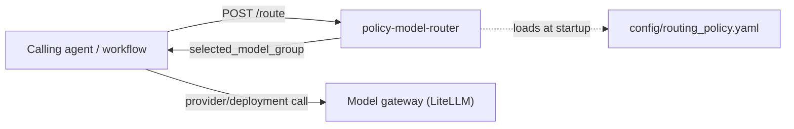
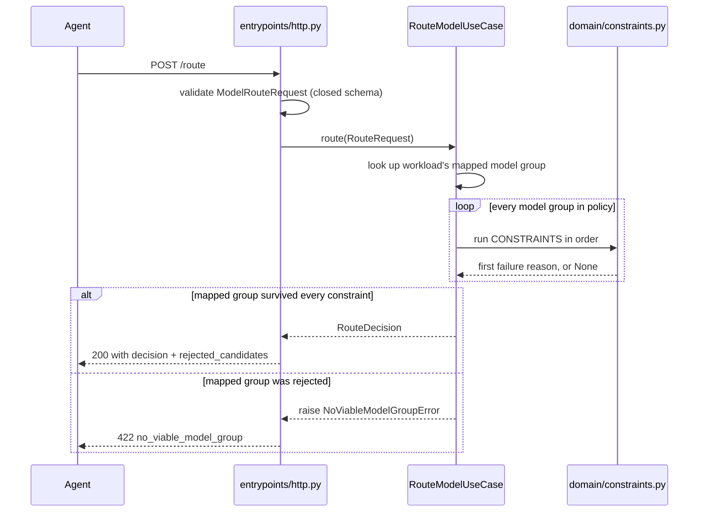

# Architecture

## Context

Policy Model Router is a standalone HTTP service that decides which logical **model group**
(`fast-small`, `reasoning-medium`, `reasoning-strong`, `fast-structured-output`) is authorized to
serve a given LLM workload, before any inference call happens. It sits upstream of a model
gateway (LiteLLM in the target deployment) and downstream of the agents that need a routing
decision.



Upstream dependency: none required. The service reads only its own routing policy file and has no
database or queue; it does have one optional real network dependency - a Redis-backed rate limiter,
used when `REDIS_URL` is configured (ADR-0008) - and none otherwise.

Downstream dependency: none from this service's point of view. Callers are responsible for taking
`selected_model_group` and resolving it to an actual provider/deployment/credential through their
own gateway. This service never calls a model and never sees prompts or completions.

`domain/enums.py` and `domain/routing.py` intentionally mirror the shape of
`credit_desk_contracts.*` from the separate `multi-agent-credit-desk` monorepo without importing
it, so this service has zero code dependency on that system. The mirror was originally
hand-maintained field-for-field; it has since diverged (ADR-0009, ADR-0010 added fields the
external monorepo does not have yet) with no automated compatibility check - see Known gaps below.

## Layers

```text
src/policy_model_router/
├── domain/
│   ├── enums.py         # DataClassification, RiskLevel, Workload, ModelGroup (closed vocabularies)
│   ├── catalog.py       # ModelGroupProfile, WorkloadRule, RoutingPolicy (declarative policy shape)
│   ├── routing.py       # RouteRequest, RouteDecision, RejectedCandidate, NoViableModelGroupError
│   └── constraints.py   # Ordered, pure eliminatory predicates (see ADR-0005)
├── application/
│   ├── ports.py         # Clock, IdGenerator, AvailabilityProvider protocols (ADR-0006)
│   └── route_model.py   # RouteModelUseCase: the two-step deterministic algorithm
├── adapters/
│   ├── routing_policy_loader.py  # YAML -> RoutingPolicy, fails closed on malformed/incomplete input
│   ├── clock.py                  # SystemClock
│   ├── id_generator.py           # Uuid4IdGenerator
│   ├── availability.py           # StaticAvailabilityProvider (no live health check; ADR-0006)
│   ├── rate_limiter.py           # InMemoryRateLimiter, default per-process limiter (ADR-0007)
│   └── redis_rate_limiter.py     # RedisRateLimiter, optional cross-replica limiter (ADR-0008)
└── entrypoints/
    ├── contracts.py     # Pydantic wire contracts + domain <-> wire mapping
    ├── http.py           # FastAPI app: POST /route (auth+rate limit), /health, /readyz, /metrics
    └── logging.py        # configure_logging(), called once at process startup
```

### Domain

Closed vocabularies (`enums.py`), immutable policy and request/decision Value Objects
(`catalog.py`, `routing.py`), and the ordered eliminatory constraint predicates (`constraints.py`).
No framework, transport, or persistence types. See ADR-0005 for the routing algorithm this layer
implements.

### Application

`RouteModelUseCase` coordinates one routing decision: look up the workload's mapped model group,
resolve each candidate's effective availability through the `AvailabilityProvider` port, run every
group through the domain constraints in order, select the mapped group if it survived, and raise a
domain error otherwise. `ports.py` defines the `Clock`, `IdGenerator`, and `AvailabilityProvider`
protocols the use case needs, on the consumer side, per the project's dependency rule.

### Adapters

`routing_policy_loader.py` parses and validates `config/routing_policy.yaml` into the domain's
`RoutingPolicy`, rejecting unknown fields and incomplete workload/model-group coverage.
`clock.py` and `id_generator.py` are the concrete `Clock`/`IdGenerator` implementations.
`availability.py::StaticAvailabilityProvider` is the only `AvailabilityProvider` implementation
today: it passes the policy's declared `available` flag through unchanged (ADR-0006).
`rate_limiter.py::InMemoryRateLimiter` is the default, per-process, fixed-window limiter;
`redis_rate_limiter.py::RedisRateLimiter` is the optional, Redis-backed alternative shared across
replicas when `REDIS_URL` is configured (ADR-0008) - both implement the same `RateLimiter` port and
are consumed directly by the HTTP entrypoint.

### Entrypoints

`http.py` is the only entrypoint: a FastAPI app exposing `POST /route`, `GET /health`,
`GET /readyz`, and `GET /metrics`. Its lifespan hook loads the routing policy, the required API
keys, and the rate limiter once at startup, and fails fast if the policy is missing/invalid, the
API keys are not configured, or the rate limiter's backend isn't reachable. `POST /route` requires
the `X-API-Key` header and is rate-limited per `(client IP, agent_name)`; `/health`, `/readyz`, and
`/metrics` require neither (ADR-0007). `/metrics` serves Prometheus-format output including the
Redis rate limiter's failure counter (ADR-0008's amendment). `contracts.py` defines the closed
Pydantic request/response schemas and the mapping to/from domain types. `logging.py` configures
structured logging once per process.

## Dependency rule

```text
entrypoints -> application -> domain
adapters    -> application/domain
domain      -> no outer layer
```

Enforced by `scripts/validate_architecture.py` as part of the quality gate.

## Cross-cutting decisions

- **Configuration**: `ROUTING_POLICY_PATH`, `APP_ENV`, `LOG_LEVEL`, `LOG_FORMAT`, `API_KEYS`,
  `RATE_LIMIT_MAX_REQUESTS`, `RATE_LIMIT_PER_IP_MAX_REQUESTS`, `RATE_LIMIT_WINDOW_SECONDS`,
  `RATE_LIMIT_FINGERPRINT_SECRET` as environment variables; no other runtime configuration.
- **Logging**: structured JSON to stdout via `configure_logging()`, with a correlation ID
  (`X-Correlation-Id`, reused from the caller or generated) bound for the duration of each
  request; no prompt, response, or personal-data content is logged. This service performs no LLM
  call tracing - it never calls an LLM (ADR-0004) - so there is no tracing adapter to configure.
- **Authentication**: per-agent API keys (`X-API-Key` header, looked up by the request's
  `agent_name`), required to start the service and checked with a constant-time comparison; not
  full IAM - no expiry, scoping, or identity assurance beyond "knew the right key" (ADR-0007,
  amended).
- **Rate limiting**: two fixed-window tiers, both checked before authentication - a light tier per
  client IP alone, then a tier per `(client IP, agent_name)`, closing the bypass where varying
  `agent_name` would otherwise dodge the second tier; per-process by default
  (`InMemoryRateLimiter`), optionally shared across replicas via Redis when `REDIS_URL` is set
  (`RedisRateLimiter`, ADR-0007, ADR-0008's third amendment). The Redis-backed limiter's fail-open
  log fingerprint is HMAC-keyed (`RATE_LIMIT_FINGERPRINT_SECRET`, or a random per-process secret),
  not a plain hash.
- **Metrics**: `GET /metrics` exposes Prometheus-format output (`prometheus_client`, a required
  dependency), including per-`/route`-outcome counters and a duration histogram (both labeled by
  `workload`), a rate-limit admit/block counter (labeled by tier), and the Redis backend-failure
  counter (ADR-0008's amendments).
- **Errors**: domain errors (`NoViableModelGroupError`, `IncompleteRoutingPolicyError`) and HTTP
  boundary errors (`AuthenticationError`, `RateLimitExceededError`) are mapped to a stable JSON
  error envelope in `http.py`; no internal exception detail is returned to the caller.
- **Time**: UTC, timezone-aware `datetime` throughout (`RouteRequest.requested_at`,
  `RouteDecision.decided_at`).
- **Money**: `Decimal` throughout - `ModelGroupProfile.input_cost_usd_per_million_tokens`/
  `output_cost_usd_per_million_tokens` and `RouteRequest.max_cost_usd` (ADR-0010).
- **Decision provenance**: every `RouteDecision` carries `policy_id`/`policy_version`/
  `policy_digest` (the loaded policy's identity, the last computed at load time from the policy
  file's decoded text content) and `service_version`/`environment` (the deployment's identity)
  (ADR-0009).
- **Idempotency**: `POST /route` is a pure decision over caller-supplied input and the loaded
  policy; it has no side effects to deduplicate. `routing_decision_id` is generated per call and is
  not a dedupe key.
- **Packaging**: multi-stage, uv-based `Dockerfile`; the runtime `CMD` starts Uvicorn against
  `policy_model_router.entrypoints.http:app`.

## Related decisions

- [ADR-0001](adr/0001-clean-architecture.md): Clean Architecture dependency boundaries.
- [ADR-0004](adr/0004-litellm-provider-boundary.md): provider/deployment selection is out of
  scope; this service returns a logical model group only.
- [ADR-0005](adr/0005-deterministic-policy-routing.md): deterministic, ordered, fail-closed
  routing algorithm with no weighted fallback in the MVP; amended to make `risk_level` eliminatory.
- [ADR-0006](adr/0006-availability-provider-port.md): availability resolved through a pluggable
  `AvailabilityProvider` port; no live health check adapter yet.
- [ADR-0007](adr/0007-http-boundary-hardening.md): per-agent API keys (amended from a single
  shared secret), in-memory per-instance rate limiting (superseded, optionally, by ADR-0008), and
  `/health`/`/readyz` endpoints.
- [ADR-0008](adr/0008-redis-shared-rate-limiter.md): optional Redis-backed rate limiter shared
  across replicas, fail-open at runtime, fail-closed at startup; amended to add a real-Redis
  integration test (run in CI), a `GET /metrics` counter for backend failures, (from a security
  review) a hashed log key, a bounded in-memory limiter, and network/proxy-trust guidance, and (a
  further review) a Docker image that actually ships the `redis` extra, a second rate-limit tier
  keyed by client IP alone, and an HMAC-keyed (not plain-hashed) fail-open log fingerprint.
- [ADR-0009](adr/0009-policy-identity-and-decision-provenance.md): every routing decision carries
  the identity of the policy and deployment that produced it (`policy_id`/`policy_version`/
  `policy_digest`/`service_version`/`environment`).
- [ADR-0010](adr/0010-token-based-cost-estimation.md): the cost constraint estimates cost from
  request token counts and per-token rates, not one flat number per model group.
- [architecture-blueprint.md](architecture-blueprint.md): the data-classification authorization
  invariant this router enforces on behalf of the platform.

## Known gaps

Tracked debt, not yet implemented. Each item is a deliberate scope boundary, not an oversight, but
should not be assumed fixed:

| Gap | Current state | Consequence |
|---|---|---|
| No live availability signal | `AvailabilityProvider` (ADR-0006, amended to be `async`) is a real seam, but the only shipped implementation (`StaticAvailabilityProvider`) still just passes through the static YAML flag; nothing polls provider/gateway health | A group can be selected while its actual deployments are down; the policy file must be edited and the service redeployed to reflect an outage. Not resolved: no real health-check target exists yet to poll - adding one now would mean integrating against a system that isn't there |
| `/readyz` does not probe Redis | Returns ready once startup completed - including a successful `ping()` of the rate limiter's Redis backend, when `REDIS_URL` is configured, but only at that one moment (ADR-0004, ADR-0008) | Cannot detect a Redis outage, or a policy that loaded successfully but is semantically wrong for the environment, once the process is already running |
| `/metrics` (and `/health`/`/readyz`) have no network-level restriction configured in this repo | Unauthenticated and unthrottled by design (ADR-0007), matching common health/scrape-probe practice; no ingress/mesh boundary is defined in `Dockerfile`/`docker-compose.yml` | Anyone who can reach the port can read metrics (minor recon: process/GC stats, `/route` outcome counts). Operators must restrict this at the ingress/mesh layer themselves - same as the existing "deploy `/route` behind an authenticated gateway" requirement |
| Rate-limit key trusts only the raw TCP peer address | `entrypoints/http.py` never reads `X-Forwarded-For`/`Forwarded`; no `ProxyHeadersMiddleware`, no `--forwarded-allow-ips` | Behind a reverse proxy, every real client shares the proxy's IP as the key's IP component, collapsing per-client granularity to one bucket (for both rate-limit tiers). A deployment that later enables proxy-header trust *without* restricting it to the proxy's own address would let any client forge the header and multiply its quota - a known misconfiguration to avoid, not current behavior |
| `credit_desk_contracts` mirror has no automated compatibility check | `entrypoints/contracts.py` originally mirrored `credit_desk_contracts.routing` field-for-field by hand; ADR-0009 and ADR-0010 added fields the external monorepo does not have yet, and there is still no shared package, published JSON Schema, or contract test between the two repos | The two contracts can drift silently; the external monorepo must be updated by hand to match, and nothing in this repo's CI would catch a future divergence |
| Both rate-limit tiers sit inside the `/route` handler body, after body validation | FastAPI resolves `request: ModelRouteRequest` (Pydantic validation) before invoking the handler function; `_bind_correlation_id` is the only check registered as ASGI middleware. A malformed body (e.g. `{}` or invalid JSON) raises `RequestValidationError` and returns 422 before either `ip_rate_limiter.allow()` or `rate_limiter.allow()` runs | A caller flooding `/route` with malformed bodies from one IP bypasses both rate-limit tiers entirely - each such request costs only a JSON parse and a Pydantic validation, no routing work, no credential comparison, and discloses nothing. Predates ADR-0008's third amendment (verified against the pre-amendment commit); the per-IP tier closes the *vary-`agent_name`* bypass specifically, not this one. Fixing it means moving the per-IP check into ASGI middleware (the per-agent tier cannot move there as-is - it needs `request.agent_name` from the parsed body) - real design work, deferred to its own ADR rather than folded into an unrelated change |

**Resolved:** the API key was a single shared secret for the whole service; ADR-0007's 2026-07-22
amendment replaced it with per-agent keys (`API_KEYS`), so one agent's key can be rotated or
revoked without affecting the others. Rate limiter state used to be per-process only; ADR-0008
added an optional Redis-backed implementation shared across replicas, opt-in via `REDIS_URL`, later
amended with a real-Redis integration test (`tests/integration/`, run against a `redis:7-alpine`
service in CI) and a `GET /metrics` counter for backend failures. A security review of that work
also found the rate-limit key (which embeds the client IP) logged in plain text on a Redis
fail-open, and `InMemoryRateLimiter`'s tracked-key dict growing without bound; both are fixed
(ADR-0008's second amendment: a hashed log fingerprint, and an `OrderedDict` capped at
`RATE_LIMIT_MAX_TRACKED_KEYS`). A further review found the Docker image did not ship the `redis`
extra at all, that varying `agent_name` bypassed the per-agent rate-limit tier entirely, and that
the fail-open fingerprint was an unkeyed hash enumerable from log access alone; all three are fixed
(ADR-0008's third amendment: `--extra rate-limit` in `Dockerfile`, a second rate-limit tier keyed by
client IP alone, and an HMAC-keyed fingerprint). `/route` previously exposed no metrics beyond the
Redis failure counter and no decision provenance beyond a bare `routing_decision_id`; both are fixed
(`GET /metrics` now includes per-outcome counters and a duration histogram, ADR-0009 added
`policy_id`/`policy_version`/`policy_digest`/`service_version`/`environment` to every decision). A
further review found that provenance existed only on accepted decisions: a `no_viable_model_group`
rejection carried none of it, and neither outcome emitted a structured log event; both are fixed
(ADR-0009's amendment: `RejectedDecision` carries the same provenance as an accepted decision, the
422 response gained an additive `decision` key, and `/route` now emits a `routing_decision`
structured log event for both outcomes). `check_max_cost` previously compared one flat number per
model group regardless of request size; ADR-0010 made it a function of the request's actual
estimated input/output token counts. All
resolutions have documented residual limits above and in their ADRs - none is full IAM, a highly
available rate-limiting service, a complete metrics surface, or a live-pricing cost model.

Add fallback/scoring behavior, a live health check, or stronger identity/HA guarantees only against
a concrete requirement (an incident, a threat model, or an evaluation dataset for tie-breaking) -
not speculatively.

## Diagrams

The sequence for one routing decision, after both rate-limit tiers and the `X-API-Key` check all
pass, in that order (ADR-0007, ADR-0008's third amendment):


