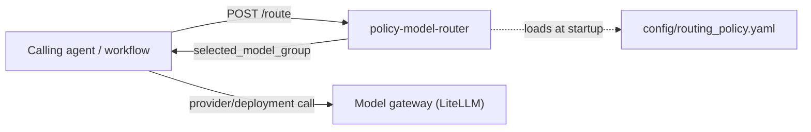
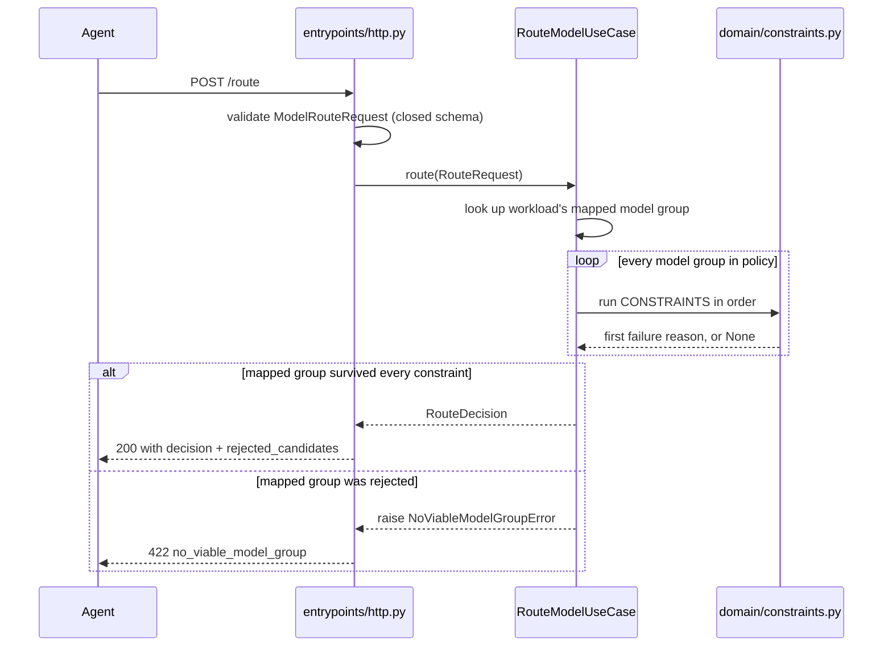

# Architecture

## Context

Policy Model Router is a standalone HTTP service that decides which logical **model group**
(`fast-small`, `reasoning-medium`, `reasoning-strong`, `fast-structured-output`) is authorized to
serve a given LLM workload, before any inference call happens. It sits upstream of a model
gateway (LiteLLM in the target deployment) and downstream of the agents that need a routing
decision.



Upstream dependency: none. The service reads only its own routing policy file; it has no database,
queue, or outbound network call.

Downstream dependency: none from this service's point of view. Callers are responsible for taking
`selected_model_group` and resolving it to an actual provider/deployment/credential through their
own gateway. This service never calls a model and never sees prompts or completions.

`domain/enums.py` and `domain/routing.py` intentionally mirror the shape of
`credit_desk_contracts.*` from the separate `multi-agent-credit-desk` monorepo without importing
it, so this service has zero code dependency on that system while staying wire-compatible with it.

## Layers

```text
src/policy_model_router/
├── domain/
│   ├── enums.py         # DataClassification, RiskLevel, Workload, ModelGroup (closed vocabularies)
│   ├── catalog.py       # ModelGroupProfile, WorkloadRule, RoutingPolicy (declarative policy shape)
│   ├── routing.py       # RouteRequest, RouteDecision, RejectedCandidate, NoViableModelGroupError
│   └── constraints.py   # Ordered, pure eliminatory predicates (see ADR-0005)
├── application/
│   ├── ports.py         # Clock, IdGenerator, AvailabilityProvider protocols (ADR-0006)
│   └── route_model.py   # RouteModelUseCase: the two-step deterministic algorithm
├── adapters/
│   ├── routing_policy_loader.py  # YAML -> RoutingPolicy, fails closed on malformed/incomplete input
│   ├── clock.py                  # SystemClock
│   ├── id_generator.py           # Uuid4IdGenerator
│   ├── availability.py           # StaticAvailabilityProvider (no live health check; ADR-0006)
│   ├── rate_limiter.py           # InMemoryRateLimiter, default per-process limiter (ADR-0007)
│   ├── redis_rate_limiter.py     # RedisRateLimiter, optional cross-replica limiter (ADR-0008)
│   └── tracing.py                # Opt-in, metadata-only tracing support
└── entrypoints/
    ├── contracts.py     # Pydantic wire contracts + domain <-> wire mapping
    ├── http.py           # FastAPI app: POST /route (auth+rate limit), /health, /readyz, /metrics
    └── logging.py        # configure_logging(), called once at process startup
```

### Domain

Closed vocabularies (`enums.py`), immutable policy and request/decision Value Objects
(`catalog.py`, `routing.py`), and the ordered eliminatory constraint predicates (`constraints.py`).
No framework, transport, or persistence types. See ADR-0005 for the routing algorithm this layer
implements.

### Application

`RouteModelUseCase` coordinates one routing decision: look up the workload's mapped model group,
resolve each candidate's effective availability through the `AvailabilityProvider` port, run every
group through the domain constraints in order, select the mapped group if it survived, and raise a
domain error otherwise. `ports.py` defines the `Clock`, `IdGenerator`, and `AvailabilityProvider`
protocols the use case needs, on the consumer side, per the project's dependency rule.

### Adapters

`routing_policy_loader.py` parses and validates `config/routing_policy.yaml` into the domain's
`RoutingPolicy`, rejecting unknown fields and incomplete workload/model-group coverage.
`clock.py` and `id_generator.py` are the concrete `Clock`/`IdGenerator` implementations.
`availability.py::StaticAvailabilityProvider` is the only `AvailabilityProvider` implementation
today: it passes the policy's declared `available` flag through unchanged (ADR-0006).
`rate_limiter.py::InMemoryRateLimiter` is the default, per-process, fixed-window limiter;
`redis_rate_limiter.py::RedisRateLimiter` is the optional, Redis-backed alternative shared across
replicas when `REDIS_URL` is configured (ADR-0008) - both implement the same `RateLimiter` port and
are consumed directly by the HTTP entrypoint. `tracing.py` provides metadata-only tracing per
`docs/LLM_OBSERVABILITY.md`.

### Entrypoints

`http.py` is the only entrypoint: a FastAPI app exposing `POST /route`, `GET /health`,
`GET /readyz`, and `GET /metrics`. Its lifespan hook loads the routing policy, the required API
keys, and the rate limiter once at startup, and fails fast if the policy is missing/invalid, the
API keys are not configured, or the rate limiter's backend isn't reachable. `POST /route` requires
the `X-API-Key` header and is rate-limited per `(client IP, agent_name)`; `/health`, `/readyz`, and
`/metrics` require neither (ADR-0007). `/metrics` serves Prometheus-format output including the
Redis rate limiter's failure counter (ADR-0008's amendment). `contracts.py` defines the closed
Pydantic request/response schemas and the mapping to/from domain types. `logging.py` configures
structured logging once per process.

## Dependency rule

```text
entrypoints -> application -> domain
adapters    -> application/domain
domain      -> no outer layer
```

Enforced by `scripts/validate_architecture.py` as part of the quality gate.

## Cross-cutting decisions

- **Configuration**: `ROUTING_POLICY_PATH`, `APP_ENV`, `LOG_LEVEL`, `LOG_FORMAT`, `API_KEYS`,
  `RATE_LIMIT_MAX_REQUESTS`, `RATE_LIMIT_WINDOW_SECONDS` as environment variables; no other runtime
  configuration.
- **Logging**: structured JSON to stdout via `configure_logging()`; no prompt, response, or
  personal-data content is logged.
- **Tracing**: metadata-only by default; see `docs/LLM_OBSERVABILITY.md` for the content-tracing
  opt-in and its approval requirements.
- **Authentication**: per-agent API keys (`X-API-Key` header, looked up by the request's
  `agent_name`), required to start the service and checked with a constant-time comparison; not
  full IAM — no expiry, scoping, or identity assurance beyond "knew the right key" (ADR-0007,
  amended).
- **Rate limiting**: fixed-window, per `(client IP, agent_name)`; per-process by default
  (`InMemoryRateLimiter`), optionally shared across replicas via Redis when `REDIS_URL` is set
  (`RedisRateLimiter`, ADR-0007, ADR-0008).
- **Metrics**: `GET /metrics` exposes Prometheus-format output (`prometheus_client`, a required
  dependency); today this is limited to
  `policy_model_router_rate_limiter_backend_unavailable_total` (ADR-0008's amendment). No metrics
  exist yet for `/route` outcomes, latency, or the in-memory rate limiter.
- **Errors**: domain errors (`NoViableModelGroupError`, `IncompleteRoutingPolicyError`) and HTTP
  boundary errors (`AuthenticationError`, `RateLimitExceededError`) are mapped to a stable JSON
  error envelope in `http.py`; no internal exception detail is returned to the caller.
- **Time**: UTC, timezone-aware `datetime` throughout (`RouteRequest.requested_at`,
  `RouteDecision.decided_at`).
- **Money**: `Decimal` for `estimated_cost_usd` and `max_cost_usd`.
- **Idempotency**: `POST /route` is a pure decision over caller-supplied input and the loaded
  policy; it has no side effects to deduplicate. `routing_decision_id` is generated per call and is
  not a dedupe key.
- **Packaging**: multi-stage, uv-based `Dockerfile`; the runtime `CMD` starts Uvicorn against
  `policy_model_router.entrypoints.http:app`.

## Related decisions

- [ADR-0001](adr/0001-clean-architecture.md): Clean Architecture dependency boundaries.
- [ADR-0004](adr/0004-litellm-provider-boundary.md): provider/deployment selection is out of
  scope; this service returns a logical model group only.
- [ADR-0005](adr/0005-deterministic-policy-routing.md): deterministic, ordered, fail-closed
  routing algorithm with no weighted fallback in the MVP; amended to make `risk_level` eliminatory.
- [ADR-0006](adr/0006-availability-provider-port.md): availability resolved through a pluggable
  `AvailabilityProvider` port; no live health check adapter yet.
- [ADR-0007](adr/0007-http-boundary-hardening.md): per-agent API keys (amended from a single
  shared secret), in-memory per-instance rate limiting (superseded, optionally, by ADR-0008), and
  `/health`/`/readyz` endpoints.
- [ADR-0008](adr/0008-redis-shared-rate-limiter.md): optional Redis-backed rate limiter shared
  across replicas, fail-open at runtime, fail-closed at startup; amended to add a real-Redis
  integration test (run in CI) and a `GET /metrics` counter for backend failures.
- [architecture-blueprint.md](architecture-blueprint.md): the data-classification authorization
  invariant this router enforces on behalf of the platform.

## Known gaps

Tracked debt, not yet implemented. Each item is a deliberate scope boundary, not an oversight, but
should not be assumed fixed:

| Gap | Current state | Consequence |
|---|---|---|
| No live availability signal | `AvailabilityProvider` (ADR-0006) is a real seam, but the only shipped implementation (`StaticAvailabilityProvider`) still just passes through the static YAML flag; nothing polls provider/gateway health | A group can be selected while its actual deployments are down; the policy file must be edited and the service redeployed to reflect an outage. Not resolved: no real health-check target exists yet to poll — adding one now would mean integrating against a system that isn't there |
| `/readyz` is a shallow check | Returns ready once startup completed; there is no external dependency to probe (ADR-0004) | Cannot detect a policy that loaded successfully but is semantically wrong for the environment |
| Redis-backed rate limiting has no metric beyond one counter | `/metrics` exposes only `policy_model_router_rate_limiter_backend_unavailable_total` (ADR-0008's amendment) | No visibility into allow/reject rates, latency, or the in-memory limiter; and nothing scrapes/alerts on the counter unless the deployment wires up its own Prometheus + alert rule — this repo only exposes the endpoint |

**Resolved:** the API key was a single shared secret for the whole service; ADR-0007's 2026-07-22
amendment replaced it with per-agent keys (`API_KEYS`), so one agent's key can be rotated or
revoked without affecting the others. Rate limiter state used to be per-process only; ADR-0008
added an optional Redis-backed implementation shared across replicas, opt-in via `REDIS_URL`, later
amended with a real-Redis integration test (`tests/integration/`, run against a `redis:7-alpine`
service in CI) and a `GET /metrics` counter for backend failures. All three resolutions have
documented residual limits above and in their ADRs — none is full IAM, a highly available
rate-limiting service, or a complete metrics surface.

Add fallback/scoring behavior, a live health check, or stronger identity/HA guarantees only against
a concrete requirement (an incident, a threat model, or an evaluation dataset for tie-breaking) —
not speculatively.

## Diagrams

The sequence for one routing decision, after the `X-API-Key` check and rate-limit check both pass
(ADR-0007):


